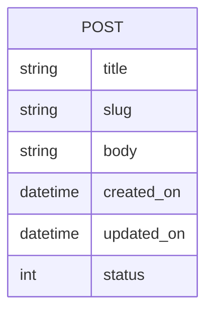

---
# Page title
title: The Blog Project

# Title for the menu link if you wish to use a shorter link title, otherwise remove this option.
linktitle: The Blog Project

# Date page published
date: 2021-03-23

# Academic page type (do not modify).
type: book

# Position of this page in the menu. Remove this option to sort alphabetically.
weight: 10

draft: False

# Featured image
# To use, place an image named `featured.jpg/png` in your page's folder.
# Placement options: 1 = Full column width, 2 = Out-set, 3 = Screen-width
# Focal point options: Smart, Center, TopLeft, Top, TopRight, Left, Right, BottomLeft, Bottom, BottomRight
# Set `preview_only` to `true` to just use the image for thumbnails.
image:
  placement: 1
  caption: "Python logo"
  focal_point: "smart"
  preview_only: false
  alt_text: Python logo

---

## Requirements

- [ ] Blogger can post on blog where text, title, and time of posting is shown
- [ ] Blog post can be draft or published
- [ ] Blog posts will have titles, readable urls (called slugs and generated from title), a body, and will show the date and time it was created and edited
- [ ] Blogger can edit blog posts and system will show last time it was updated
- [ ] Website will show a list of blogposts with summary of the body
- [ ] User can select a post from the list of blog posts to view the details
- [ ] Assume there is a single author for all blog posts that never change 

#### Some Useful Tips

- Consider the requirements as a checklist that you check everytime you complete one. When you have completed all requirements then your project is complete. 
- For most requirements, you will go through the the process described in the [Django Development Process]()

## ER-Diagram

The ER-Diagram describes the data requirements and will be used for constructing the project's data models in models.py. The blog data model is currently very simple and contains a single entity:

## How To Follow Along This Project

First, Create a repl by importing from the github repo **malmarz/isom350-blog** as shown here:



Then, once the project is created, you can easily view the implementation step by switching to the approriate branch. For example, to see the code to implement the data model step in the development, you switch to the data model branch through version control as shown in here:



Similarly you can switch to the appropriate step to see how it is implemented.

Please note however, you must attemp to implement the same step on your own to learn how to develop web applications. Switch to the solution branch to check your solution and learn how you could have done it correctly.

### How to Attempt Build The Project Yourself.

1. Create a new repl that is based on the **Django Template**.
2. Attempt to build the project by completing the [requirements listed here]()
3. If stuck, open the solution project and compare against your work
4. Attempt to read the [Django Project Documentation](https://docs.djangoproject.com/en/3.1/) and think of ways to improve your web application beyond the requirements.
5. Feel free to demonstrate your work to others by sharing the test URL for your project. Just make sure that the Django test server is running, otherwise they will not be able to test your web application.

