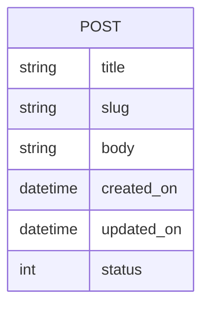

{}
Switch to branch **2-models** from **malmarz/isom350-blog** github repo to see this step's implementation
{}

لنقم بإنشاء النماذج اللازمة لمشروع المدونة الخاص بنا بناءً على مخطط ER الخاص بالمشروع:



يعد هذا مشروعًا بسيطًا به كيان واحد يسمى POST ، حيث سنخزن لكل منشور العنوان ، و slug (الذي يستخدم لإنشاء عنوان URL قابل للقراءة لمنشور المدونة) ، ونص المنشور ، وتاريخ الإنشاء والتحديث ، و أخيرًا الوضع. لذلك دعونا نفتح نماذج. py وننشئ النموذج:

```python
from django.db import models

class Post(models.Model):

```

هنا قمنا بإنشاء نموذج Post ، مما يعني أننا نريد جدولًا في قاعدة البيانات الخاصة بنا لتخزين المعلومات حول المنشورات. لكننا ما زلنا لم نحدد ما سنخزنه حول المنشور. لذلك ، نحتاج إلى تحديد الحقول داخل المنشور. يسمح لنا الحقل بتحديد اسم ونوع البيانات التي نريد تخزينها من المنشور.

بناءً على مخطط ER ، نعلم أننا نريد تخزين عنوان المنشور ، وهو عبارة عن سلسلة. لذلك دعونا نلقي نظرة على نوع [الحقول المتوفرة في وثائق Django] (https://docs.djangoproject.com/en/3.1/ref/models/fields/). إذا نظرت إلى العمود الأيمن لوثائق حقول نموذج django ، فسترى قائمة بنوع الحقول التي يمكننا تضمينها في نموذجنا. دعنا نبحث عن نوع الحقل الذي يسمح لنا بتخزين بيانات السلسلة. يمكنك أن ترى أن هناك العديد من أنواع الحقول ، بعضها للأعداد الصحيحة أو الصور أو رسائل البريد الإلكتروني. الحقول التي تسمح لنا بتخزين السلاسل هي إما [CharField] (https://docs.djangoproject.com/en/3.1/ref/models/fields/#charfield) أو [TextField] (https: //docs.djangoproject .com / en / 3.1 / ref / Models / الحقول / # textfield). كلاهما يسمح لنا بتخزين سلسلة كجزء من نموذج Post الخاص بنا. ولكن عند قراءة وثائقهم ، يكون CharfField أكثر ملاءمة عند تخزين السلاسل ذات الطول المحدود ، بينما يتم استخدام TextField إذا كانت السلاسل طويلة أو تتطلب طولًا غير محدود. تحتوي العناوين عادةً على عدد محدود من الأحرف قد لا يتجاوز 200 حرف. لذلك دعونا نضيف حقل عنوان من نوع الحرف بحد أقصى 200 حرف:

```python
from django.db import models

class Post(models.Model):
    title = models.CharField(max_length=200, unique=True)
```
لاحظ أيضًا كيف يمكنك تعيين خيارات إضافية للعنوان. هنا اخترنا أن العنوان فريد ، بمعنى أن Django سيمنع أي شخص من إنشاء نفس العناوين لمشاركتين مختلفتين. يمكن أيضًا العثور على خيارات الحقول في [وثائق حقول نموذج Django] (https://docs.djangoproject.com/en/3.1/ref/models/fields/). تأكد من قراءتها بعناية وتكوين نماذجك بالطريقة التي تريدها أن تتصرف بها.

الآن دعنا نكمل تعريف النموذج لجميع الحقول الأخرى التي نحتاجها من خلال الرجوع أيضًا إلى الوثائق. سننتهي مع التعريف التالي الذي يتوافق مع مخطط ER الخاص بنا:

```python
from django.db import models

class Post(models.Model):
  title = models.CharField(max_length=200, unique=True)
  slug = models.SlugField(max_length=200, unique=True)
  body = models.TextField()
  created_on = models.DateTimeField(auto_now_add=True)
  updated_on = models.DateTimeField(auto_now=True)
  status = models.IntegerField(default=0)
```

لكن لاحظ حالة الحقل. نريد قصر قيم الحالة على 0 إذا كان المنشور عبارة عن مسودة ، أو 1 إذا تم نشر المنشور. لذلك نقوم بإنشاء الاختيارات وتكوين الحقل لاستخدام هذه الاختيارات فقط. سيمنع هذا أي شخص من إدخال قيم غير 0 أو 1 للحالة:

```python
from django.db import models

 STATUS = (
    (0,"Draft"),
    (1,"Publish")
  )

class Post(models.Model):
  title = models.CharField(max_length=200, unique=True)
  slug = models.SlugField(max_length=200, unique=True)
  body = models.TextField()
  created_on = models.DateTimeField(auto_now_add=True)
  updated_on = models.DateTimeField(auto_now=True)
  status = models.IntegerField(choices=STATUS, default=0)
```

خيرًا ، بالنسبة للخطوة التالية ، نود أن تعرض كائنات نموذجنا رسالة مفيدة عندما نعرضها في واجهة المسؤول. لذلك ، يجب علينا تحديد وظيفة خاصة تسمى ** __ str __ **. يمكننا تعيين ما يتم عرضه عندما يحاول شخص ما طباعة كائن من نموذج Post:

```python
from django.db import models

 STATUS = (
    (0,"Draft"),
    (1,"Publish")
  )

class Post(models.Model):
  title = models.CharField(max_length=200, unique=True)
  slug = models.SlugField(max_length=200, unique=True)
  body = models.TextField()
  created_on = models.DateTimeField(auto_now_add=True)
  updated_on = models.DateTimeField(auto_now=True)
  status = models.IntegerField(choices=STATUS, default=0)

   def __str__(self):
    return self.title
```

مع اكتمال نموذجنا ويمكننا الانتقال إلى الخطوة التالية لتكوين واجهة المسؤول لإدارة هذه النماذج. لمزيد من المعلومات ، يرجى الرجوع إلى [توثيق Django حول نماذج قاعدة البيانات] (https://docs.djangoproject.com/en/3.1/topics/db/models/).
