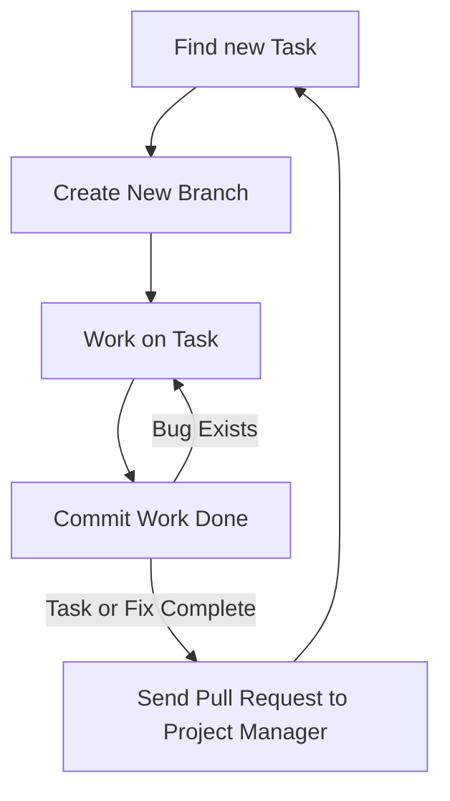

---
# Page title
title: Development Collaboration

# Title for the menu link if you wish to use a shorter link title, otherwise remove this option.
linktitle: Collaboration

# Date page published
date: 2021-03-23

# Academic page type (do not modify).
type: book

# Position of this page in the menu. Remove this option to sort alphabetically.
weight: 3

draft: False

---

العمل بشكل فعال كفريق هي احدى الجوانب الاكثر صعوبة في تطوير البرامج.
تكون هذه المشكلة اكبر بالنسبة للمبرمجين عديمي الخبرة لأن طريقة نظام النص التشفيري للبرنامج ستؤثر على مدى تعامل اعضاء الفريق مع بعضهم البعض.
لحسن حظنا، نحن نستخدم "جانقو"، لقد تم تنظيم طريقة عمل نظام الشفرة مسبقاً، مشاريع "جانقو" منظمة لكي نستغل ال “OOP” و نتمكن من العمل كفريق بشكل فعال. 

ويبقى السؤال: كيف لأعضاء الفريق أن يتعاملوا مع بعضهم و يجمعوا النص التشفيري الى نص موحد. 

هناك طريقتين للتعاون أو للعمل كفريق:

# 1- التعاون المتزامن 

في التعاون المتزامن عبر الانترنت، أعضاء الفريق المتعاون يقومون بالعمل على نفس الملف في نفس الوقت مع بعضهم البعض،
تسهل هذه العملية خلال موقع “repl.it” و تتطلب فقط إرسال رابط الملف الى اعضاء الفريق، موقع “repl.it” يقوم بعمل فعال في التعاون المتزامن حيث أنه يسمح لأعضاء المجموعة أن يعملوا على ملف واحد في آن واحد وأن يتواصلوا مع بعضهم خلال العمل.

مع ذلك، هذا النوع من المشاركة محدود:
١. يتطلب جدول منسق
٢. عدد المشاركين محدود، من المنطقي أن يعمل فردان في وقت واحد 
٣. مساهمة الأفراد غير متابعة 
٤. ممكن أن تتطلب خبرة فرد من الأفراد لتتم عملية المشاركة بنجاح

الفائدة الأساسية للمشاركة المتزامنة عبر الانترنت هي مشاركة العلم. 
يعمل المساهمين على حل المشاكل و في النهاية يستفيد الفرد الأقل خبرة بشكل كبير من أعضاء الفريق الآخرين، التعاون المتزامن مشابه ل”eXprogramming” نوعا ما.

## كيفية استخدام التعاون المتزامن على موقع Replit.com؟

هناك طريقتان رئيسيتان:

1. قم بإنشاء فريق 
repl كجزء من
[فريق MISCBA على replit.com]
 يسمى **repl متعدد اللاعبين**
(https://replit.com/team/miscba)



ثم شارك عنوان ال url من المتصفح:



2. بدلا من ذلك، يمكنك إنشاء 
repl 
عادي مع إضافة متعاونين باستخدام زر المشاركة:



# 2- Asynchronous Collaboration

في التعاون الغير متزامن، أفراد المجموعة بإمكانهم العمل على المشروع في وقتهم الخاص ولا حاجة للتفاعل مباشرة مع اعضاء المجموعة،
بدلاً من ذلك، يتم استخدام نظام لإدارة كيفية قيام كل عضو بتغيير نص المشروع ولتمكين دمج العمل من أعضاء متعددين في نص واحد، هذه هي الطريقة الأكثر فعالية والأكثر استخداماً للتعاون في البرمجة، النظام الأكثر شيوعاً في الوقت الحالي لأدارة العمل المتزامن هو “git” الذي يوفره موقع “github”.

سيتطلب استخدام git أو github من المطورين تعلم أداة جديدة قد لا يكون من السهل تعلمها في البداية. ولكن بمجرد استخدام المطورين للأداة بشكل صحيح ، من الممكن تمكين تعاون آلاف المطورين في مشروع واحد ، كما يمكن رؤيته في [مشروع لينوكس كيرنال]
(https://github.com/torvalds/linux).

لحسن الحظ، يتكامل موقع 
replit.com 
جيداً مع 
github، 
سنستخدم ميزات 
git
الرئيسية من داخل 
replit.com،
وبالنسبة للمهام الأخرىمثل دمج وحل المشاكل والتعارضات،
سنستخدم واجهة الويب التي يوفرها
github.com
لأداء هذه المهام المتعلقة بالتعاون.

استخدام github
لا يكفي للتعاون بشكل فعال، لكي تكون فعالة يجب استيفاء الشروط التالية: 
1. تم تنظيم الكود لتمكين التعاون (يفرض Django ذلك على المشروع بالطريقة التي ينظم بها الكود)
2. يجب أن يتفق الفريق على سير عمل يصف كيف سيبدأ كل عضو العمل ، وما يجب العمل عليه ، وكيفية مشاركته عند الانتهاء.
3. يجب على جميع أعضاء الفريق الالتزام بسير العمل عند الترميز  للمشروع.
## سير العمل

سيكون لكل فريق مسار عمل خاص به ، ولذا فإننا نوصي بمسار عمل لتستخدمه في هذه الدورة التدريبية. سير العمل كما يلي:

** يمكن أن تكون المهمة ** إنشاء ميزة جديدة أو إصلاح خطأ موجود. يصف مسار العمل الطريقة التي يجب أن يتصرف بها المطورون عند العمل في مهمة. الخطوات الرئيسية هي:

{}
 لمعرفة الخطوات التي نفذت على GitHub
 معرفة الخطوات التي نفذت على Replit.com
{}

1.  **Find a task or fix to work on:** It is the responsibility of the project manager to ensure that developers can find tasks to work on. These can be found listed on GitHub issues, the ticketing system used for the project, speaking to the project manager, or reading the requirements document. For this course, project managers should write down tasks as issues in GitHub. Developers can also assist by writing issues that can either bew feature suggestions or descriptions of bugs that need to be fixed. We will discuss project management in more detail in [the next section]().
2.  **Import your project from GitHub** as shown in the figure. It is also fine to import the same project again every time you want to start new work to ensure you get a fresh copy of the code.

   - **IMPORTANT: Pull updates for existing projects:** If you don;t want to import the project again and lose your work on replit, be sure to **pull** updates that were merged to the master branch by the project manager on GitHub. This will guarantee that you start your work with the latest version of the code

3.  **Create a new branch:** Branches allow a developer to change the code without fear of ruining the project. When starting on a programming task, always create a new git branch for the task from the master branch. A branch allows you to change the code for you only, and not affect the work of others. You need to always remember the following:
   - **NEVER work directly on the master branch**. 
   - **Create a new branch** from the master branch only.
   - The Master branch **should always** have a working copy of the project, never a broken one.
   - **Choose a name** for the new branch that reflects what work is done. For example bug_1234, where the number is the issue number on github. Or feature_1234. To learn about what characters are allowed in a branch name [please read this article](https://git-scm.com/docs/git-check-ref-format).



4.  **Working on the task**: Ensure that the task you are working on is small and simple. If there are large and complex tasks, break them down into smaller tasks.
5.  **Commit the task**: Upon completion of the task, or reaching a milestone in your work, you must commit the work. This would allow you to create a snapshot of the work you did to be stored in the github history. The advantage of having a commit snapshot is that you can return to this version of the code any time. Therefore, it is recommended to commit frequently and even for small changes. Just make sure when you commit that you write a useful message for the history to know what you did in that commit. You must always commit and test your work and continue to change the code and commit until you are sure that the changes you did are acceptable and the task is complete.
   
6.  **Send a pull request**: If you are sure the task is complete then use github to send a pull request. The pull request tells the project manager that the work on this branch is complete and ready to be added to the master branch. It is the responsibility of the project manager to respond to the pull request and merge it into the master branch. The pull request can be to merge two branches from the same repository, as we will mostly do in this course. This is the case for team members working on the same repo: 



It can also be used to request merging branches between forked repositories and allow you to send your work to a project that you are not a member of:



Once a pull request is created the project manager and team members can discuss this pull request and see what is done so far by the project manager regarding the matter.



Everyone is expected to follow these steps whenever you work on development projects in this course. It might seem like an overhead at first, and you will not see the benefits right away. However, the goal is to get you to practice how to code as part of a team. So when you start your final project, you will start to see the benefits of this workflow.

## Git and GitHub

Know that the tool we use for asynchronous collaboration is known as **Git**. It allows developers to keep track of all changes done to their projects. It can be used on the developer's computer using the command line or the GitHub desktop application. You can use it without GitHub.

GitHub is the cloud platform hosting Git services. Its a social media platform for developers built around the Git application. Because Git is so useful for developers, it is hosted for on their platform for all to use for free, provided they make their repositories public. You can pay a subscription if you wish to have private repositories. Furthermore, GitHub built a set of project management tools and social coding tools around Git. The issues, classroom, projects, pull requests, and developer profiles are not part of Git, but were added specifically for GitHub and to make coding more social. We will use many of these features to improve collaboration and for project management purposes.

There are numerous terms that you need to be aware of to use Git and GitHub effectively. We summarize them in the following table. The domain determines whether this term is specific to the Git application or has been introduced as part of the additional social features built by GitHub:

### Git and GitHub Terminology

| **Term** | **Domain** | **Meaning** |
| --- | --- | --- |
| **Repo/Repository** | Git | A repository is where the source code and history of all actions and changes done to it resides. A local repo exists on the developer&#39;s computer and is required for the developer to do work. A remote repo is one that exists on another machine. A GitHub repo is hosted on GitHub to make it accessible for other developers and is considered a remote repo to all developers. |
| **Clone** | Git | Creating a local copy of a repo. The copied repo can be either remote or local |
| **Fork** | GitHub | Similar to a clone but it occurs on GitHub servers. A GitHub repo is created as a copy from another GitHub repo. The new repo will have its own project space, including issues, wikis, and discussions. |
| **Commit** | Git | In CVCS, commit is the act of publishing changes, made locally, to the central repo. For Git, it is an instruction for Git to take a snapshot of the code base in its current state. The snapshot is referred to as a revision. Committing the code base would create the revision locally. To transfer the revision to another repository, the local developer must push it, or an external developer must pull it. |
| **Rev/Revision** | Git | A snapshot of the code base taken by the commit command. A revision is represented by a SHA1 string that is unique to that revision. A developer can switch to any previous state of the code base, whether as a whole or as a single file, by referring to the revision number. |
| **Checkout** | Git | An action to revert the code base, a file, or a group of files to a specific revision |
| **Branch** | Git | Creating a named copy of the source code hosted in a repo that allows the developer to experiment and make changes to the source code and commit them to create new revisions. The developer can delete the branch if not satisfied with the work and discard all the revisions made in the branch, or the developer can merge the branch to the master branch, thereby making the new revisions part of the master. |
| **Master branch** | Git | The main branch used to host all code that has been accepted (the master copy). Developers typically do not work directly on the master branch but create alternative branches to work on, then merge accepted code changes to it. Whenever developers need to start with a fresh copy of the code base, they typically branch out of master. |
| **Merge** | Git | Combining the revisions from two different branches is known as merging. It is performed automatically on pulling or pushing branches. The merging can occur smoothly and automatically if the revisions have no conflict. This is known as a fast-forward merge. If the combined revisions are in conflict, then the developer must resolve the conflict in all the files manually, then explicitly perform the merge. |
| **Conflict** | Git | A conflict occurs when two revisions change the same line, and these changes cannot be consolidated. Git will highlight these lines for the developer and include both lines from each revision so the developer can view them side by side and manually combine them. Once all the files with such conflicts are resolved and saved, the developer must manually issue a merge command for Git to accept the conflict resolution. |
| **Push** | Git | An action that would allow the developer to pull revisions from another branch to the branch the developer is currently working on. Only the revisions unique to the branch being pulled from are moved to the working branch. The branches do not have to be on the same repo. The developer can pull a branch from a remote repo. A push cannot be performed if there is a conflict between the working branch and the remote branch. The developer must pull the remote branch first, resolve any conflict, then push the merged revisions. |
| **Pull** | Git | An action that would allow the developer to send revisions to a branch from the branch the developer is currently working on. Only revisions unique to the working branch are sent to the other branch. The branch being pushed to can be on the local repo or a remote repo. |
| **Pull Request** | GitHub | An action popularized by GitHub. To pull from a remote branch, the developer needs to know the address of the remote machine. GitHub streamlined this process by allowing the developer with new revisions to send a request from his/her repo to another repo on GitHub. The repo would include information on the address and branch to pull from. The developer receiving the pull request can view the changes, have a conversation about them, and either accept or reject them. If accepted, the changes are merged to the repo the pull request was sent to. |
| **Upstream** | Git | The chain of remote repositories that the current repo cloned from. Pushing code upstream requires effort, as conflict must be eliminated. Pull requests are typically sent to repos in the upstream. |
| **Downstream** | Git | The network of all repos that have been cloned from the current repo. Code trickles down effortlessly, as the responsibility of resolving conflict is delegated to the developers in the downstream when they pull from the current repo. |

