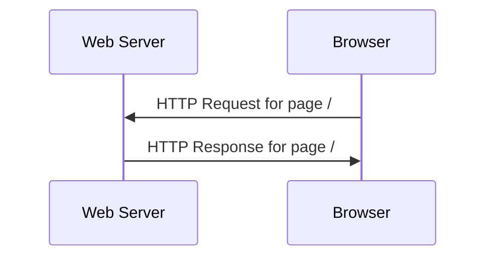
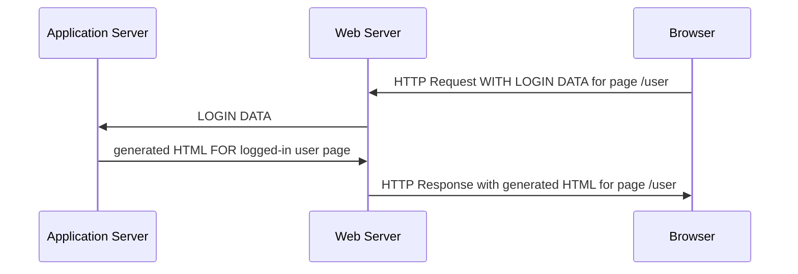
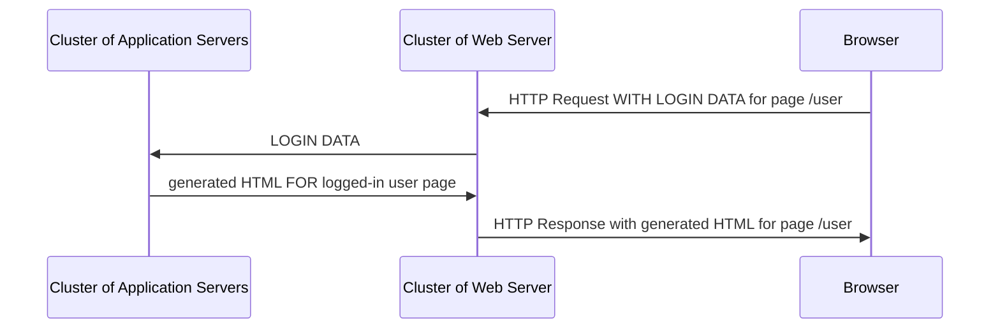
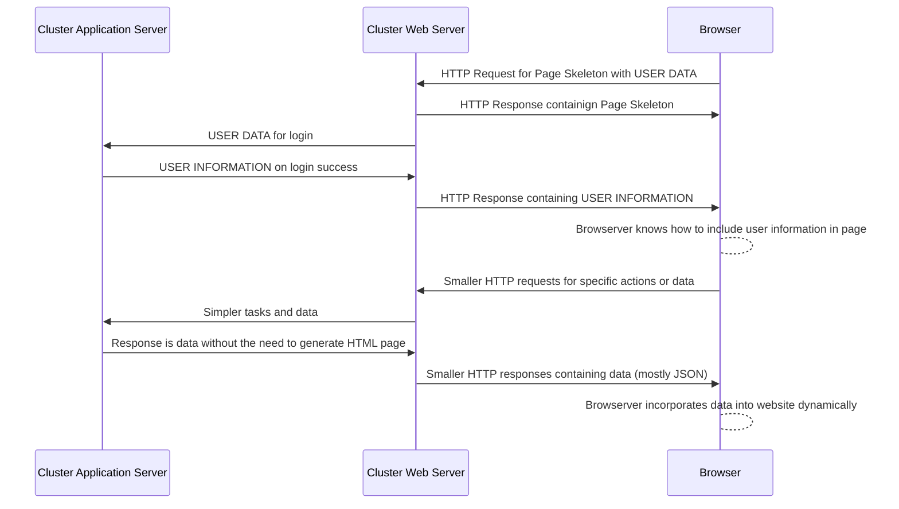

---
# Page title
title: Web Applications

# Title for the menu link if you wish to use a shorter link title, otherwise remove this option.
linktitle: Web Applications

# Date page published
date: 2021-03-23

# Academic page type (do not modify).
type: book

# Position of this page in the menu. Remove this option to sort alphabetically.
weight: 5

draft: False


---

Web applications are applications that run in the web browser. Web applications have replaced desktop applications because of the following benefits:

1. **Interoperability**: حيث أن المتصفحات متوفرة على جميع أنواع أجهزة الكمبيوتر والهواتف في العصر الحالي بغض النظر عن المواصفات أو نظام التشغيل المستخدم. لذلك ، يمكن استخدامها من قبل عدد أكبر من العملاء المحتملين.
2. **Manageability**: تم تطوير الكود مرة واحدة والاحتفاظ بها على خادم ويب مركزي. لتحديث التطبيق أو إصلاح الخلل ، يجب على مالك التطبيق تحديث التطبيق فقط على الخادم الخاص به وسوف يستفيد جميع العملاء من التحديث. على عكس تطبيقات سطح المكتب حيث يُطلب من العملاء تنزيل إصدارات أحدث من التطبيق. في تطبيقات الويب ، يتم التحديث بشفافية.
3. **Relative Security**: على الرغم من أن الأمان يمثل تحديًا دائمًا ، فإن حقيقة أن التطبيق يُدار في موقع مركزي يعني أن المالك يتمتع بقدر أكبر من التحكم فيما يتعلق بمراقبة التطبيق وإدارته وتحديثه. جعل الأمان ** أسهل نسبيًا ** مقارنة بتطبيقات سطح المكتب القائمة على الخادم. 
4. **Rapid Improvement in tools and Capabilities**: نظرًا لمستوى الابتكار الذي يحدث في أدوات تطوير تطبيقات الويب والبنية التحتية ، هناك نوع معين من التطبيقات أو المهام التي لا يمكن تنفيذها إلا عند استخدام تطبيق ويب حيث يمكن أن تنمو البنية التحتية لتطبيقات الويب لاستيعاب عدد أكبر من المستخدمين والقدرات. على سبيل المثال ، نشأ عصر البيانات الضخمة بسبب ظهور تطبيقات الويب على نطاقات تخدم العملاء العالميين. 
   
ومع ذلك ، تأتي تطبيقات الويب مع مجموعة التحديات الخاصة بها:
1. **Complexity of Infrastructure**:لم يعد تطوير التطبيقات مجرد مسألة بناء البرنامج. يتضمن بناء تطبيقات الويب الآن بناء البنية التحتية ، وبناء البرامج ، وإدارة نشر التطبيق وتشغيله بما في ذلك التعامل مع أي مشكلات تتعلق بالتوسيع قد تنجم عن زيادة عدد المستخدمين. كل هذه مشكلات لم يتم أخذها في الاعتبار عند إنشاء تطبيقات سطح المكتب التقليدية.
2. **Security and Privacy**: بيانات المستخدم والأمان هي الآن مسؤولية مالك تطبيق الويب. نظرًا لأن التطبيق سيتطلب اتصالاً بالإنترنت ، فإن هذا من شأنه أن يؤدي إلى طبقة إضافية من المخاطر التي يحتاج المالك إلى مراعاتها وإدارتها.
3. **Requires an Internet Connection**: سواء أكان تطبيقًا بسيطًا أو تطبيق شبكة معقدًا ، فستتطلب تطبيقات الويب دائمًا من المستخدم أن يكون لديه اتصال بالإنترنت. هذه بالتأكيد ليست مشكلة كبيرة في هذا العصر ، ومع ذلك ، فهذا يعني أنه لا يمكن استخدام تطبيق الويب في المواقف التي لا يتوفر فيها الإنترنت.
4. **Rapid Improvement in tools and Capabilities: هذا هو في الواقع منفعة والتزام. تخضع الأدوات المستخدمة لبناء تطبيقات الويب لتحسين سريع مع ظهور تقنيات جديدة كل يوم. في حين أن هذا يعني أن تطبيقات الويب ستتمتع بإمكانيات جديدة ، فهذا يعني أيضًا أن مالك تطبيق الويب يحتاج إلى التحسين والتعلم بسرعة حيث يمكن بسهولة حذف معرفته التنموية الحالية في غضون فترة زمنية قصيرة.

## Web Application History

تطورت تطبيقات الويب على مر السنين لتأخذ أشكالًا مختلفة. هذا التاريخ المختصر وسيوضح الفرق بين صفحة الويب و تطبيق الويب.

### Web Page

In the early days of the internet and when the web browsers were invented, we had web pages. Web pages contained static content (does not change as the user changes). The main innovation was hyper text, which allowed linking of related documents. In these days, the internet was not commercialized and web sites were used to dissimenate information. Content was produced using website owners. But the main protocols used to transfer web page information (HTTP) and display web page (HTML) was developed during this era. Browsers would send an HTTP request to open a page, and the web server would respond with an HTTP response containing the HTML and images needed to construct the page on the browser. Information was only pushed from the web servers to the web browser, there was no information exchange.



### Early Web Applications

HTTP then added other actions to the protocol and now browsers can send files and information to webserver using POST and PUT actions. HTML also got the FORM tag which allows user to enter data to send to the webserver. HTTP is still based on request and response cycle, but now communication is both ways. The innovation paved the way for conducting transactions using web browsers and the commercialization of the internet started along with eCommerce websites. Now websites can forward the information received from browsers to application servers that generate HTML pages on the fly, with websites still serving static files like images to the browsers. This allowed for dynamic pages where a each user would see different information on the same URL. These dynamic web pages are what is now known as web applications. Content in this era was mostly generated by website owners.


### Web 2.0 Applications

All that changed in the Web2.0 era is that web applications were leveraged to involve the user in generating the content for web applications. Wikipedia, twitter, facebook ..etc. All these platforms did not have content but relied on the network of users to generate content and value. The web application though was still the same utilizing an application server that performed the actions and web server serving only static files. However, the scale is now much bigger and the infrastructure is no much more complex to be able to handle the increase in number of users and content traveling both ways. A webapplication such as facebook's would have a cluster of webserver and another for application servers, and a third for databases all working together to to serve as the infrastructure for the facebook platform. With this increase in users, now emerged the need to make the websites more responsive and less demanding, which was the empitus for the next stage in the evolution of web applications. 




### HTML5 Web Applications (Dynamic, Frontend Applications)

The biggest change in this era of dynamic webpages is the idea that a page does not have to be fully reconstructed after every request is sent to the webserver. Why not serve a page skeleton when the user first open a webapplication, then subsequent requests to the server can be for small bits of information which the browser would know how to include in the page. Which is why javascript was included in browsers specifically to allow for developers to implement HTML pages that can change dynamically. The page is still static HTML and CSS, but the javascript allowed it to change. These technologies evolved into what is known today as HTML5 web applications. The focus of this era is on user experience. TNow the browser and webserver cooperated to present the user with an improved web application experience that felt like desktop applciations. Web development was now split into frontend development for designers that focus on the browser, and backend development for engineers that focus on the infrastructure and data.



### The Web Application Infrastructure

|   |  Web Page | Web Applcation  |  Web 2.0 Application | HTML5 Application  |
|---|---|---|---|---|
| Browser  | Standard HTML browsers | Standard HTML Browsers  | Standard HTML browser  | Modern Browsers with HTML5 capabilities  |
| Web Server  | Serves HTML, images, and files  | Serves HTML, images, and files.</br>Forwards data to application server | Serves HTML, images, and files.</br>Forwards data to application server  | Serves HTML, images, and files.</br>Forwards data to application server | Serves HTML, images, and files.</br>Forwards data to application server</br>Cloud hosted components becoming more prominent |
| Application Server | N/A  | Needed for Business Logic  | Needed for Business Logic  | Optional, since logic can be implemented in the browser now |
| Content | Static | Dynamic  | Dynamic  | Dynamic  |
| Page Rendering | New page with every Request/Response Cycle  | New page with every Request/Response Cycle | New page with every Request/Response Cycle | Part of the page updated only  |
| Request/Response Cycle | Fetching files and static HTML only | Data exchange and page rendering   |  Data exchange and page rendering |  Data exchange and page rendering |


### The Infrastructure in the Cloud Era

While the components of the infrastructure are the same, the biggest change in the cloud era is that many of the infrastructure components are now cloud based. Meaning, some might be SaaS services offered by companies that focus on a specific component of the infrastructure. So for example, a web application might have its database managed by amazon, webserver by digital ocean, CDN by cloudflare. Other services might be added to the infrastructure like authenticaion or geospatial database that are managed by other providers. The owner of the web application manages a **mashup** of these services and bundles them into a usable application.

### The Application Server

The application server is a server that accepts requests forwarded from the webserver and is able to generate an appropriate HTTP response. The application server utilizes programming languages to process requests and can construct a unique HTML body on the fly. The type of programs written for the applciation server typically involve writing functions that take HTTP requests as inputs and generate HTTP responses containing HTML or other forms of content in the body of the response. Languages used for building applciation servers include Java, Python, C#, Ruby, Scala, Go, Javascript, and numerous other languages. It is the logic writen in these servers that is considered the logic of the web application. Such servers would be responsible for managing authentication, cart management, transaction management. The applicaiton server are not designed to handle serving static files and images, and might include these features for testing purposes only. As a result, when building a web application, a test application server needs to run before you can see the results on your browser. If the server is not running, you cannot test the application that is built.

### The Request Response Cycle

Serving an HTML page or web application always starts with the browser. The user must type the correct URL. The URL looks something like the following:

    http://www.twitter.com/signup

**http://** is the protocol part. Its how the user tells the browser which protocol to use to communicate with the server. Other common protocols that browsers can use are **https://** for secure communication with web server and **ftp://** for communication with file servers.

**www.twitter.com** is the hostname part. The **twitter.com** part from the hostname is known as the domain. The hostname is an alias for the IP address of the server. It gets translated by DNS services to an IP address which the browser uses to determine which server on the internet to communicate with.

**/signup** is known as the path. This determines what file or service we would like the web application or server to provide. The **/** is known as the root path. Typically is provides the browser with the main page that the user will see when visiting a website. Then, every function, file, image, or service on the website or web application will have its own unique path. When building web applications, the servies must be associated with a unique path, otherwise the users will not have access to the service.

After typing the URL in the browser, first the browser will try to find the IP address of the webserver based on the provided hostname by communicating with DNS services. Once the IP is obtained, the browser will initiate communication using the requested protocol, typically, this will be HTTP.

Communication is always initiated by browsers, also known as clients. Web applications are considerd a form of client/server application with the browser being the client and the web server being the server. When communication is established, the browser sends a text based request, known as the HTTP request, containing the information needed by the server to provide the requested service. The HTTP request looks something like this:

```
GET /hello.htm HTTP/1.1
User-Agent: Mozilla/4.0 (compatible; MSIE5.01; Windows NT)
Host: www.tutorialspoint.com
Accept-Language: en-us
Accept-Encoding: gzip, deflate
Connection: Keep-Alive
```

Here the client is telling the server that is wants to **GET** the file **/hello.html** using the **HTTP 1.1** communication protocol. The host part identifies the hostname that the client is trying to communicate with. All other lines are information about the client so the server knows how to provide the correct data to the client. This request is known as a GET request and is used to receive files, images, and HTML pages.

The server would respond with a standard HTTP response that might look like this:
```
HTTP/1.1 200 OK
Date: Mon, 27 Jul 2009 12:28:53 GMT
Server: Apache/2.2.14 (Win32)
Last-Modified: Wed, 22 Jul 2009 19:15:56 GMT
Content-Length: 88
Content-Type: text/html
Connection: Closed

<html>
<body>
<h1>Hello, World!</h1>
</body>
</html>
```

The first line provides confirmation that the server successfully found the requested data and will be serving it. The lines that follow all provide information on the response. The response also include a body which contains the requested data. The body starts from the line containing **\<html\>** and goes to the end of the response. The body part of the HTML page that is to be shown to the user.

POST requests are slightly different from GET requests in that they typically also include a body, as the goal from the POST request is to send data to the webserver. The POST request can look something like the following:

```
POST /cgi-bin/process.cgi HTTP/1.1
User-Agent: Mozilla/4.0 (compatible; MSIE5.01; Windows NT)
Host: www.tutorialspoint.com
Content-Type: application/x-www-form-urlencoded
Content-Length: length
Accept-Language: en-us
Accept-Encoding: gzip, deflate
Connection: Keep-Alive

licenseID=string&content=string&/paramsXML=string
```

It is very similar to the GET request, except it has the body which is the line starting with licenseID. This line includes information that is URL Encoded that will be delivered to the server. Typical examples of using POST requests is to send username and password combinations or the context of a tweet or blog post. It all depends on the web applciation and its the responsibility of the developer to write the function that extracts the data from the request and performs the proper action with it, like storing it in a database or rendering the HTML page.

This is a simple introduction to HTTP protocol, for more detailed description of the protocol please [read this post](https://developer.mozilla.org/en-US/docs/Web/HTTP/Messages). Understanding how HTTP works is key to understanding the security issues associated with web applications and to understand how to manage and scale web applications.

### The Protocols

- **HTTP:** Hyper Text Transerver Protocol. This is a clear text based protocol where client and server communicate using readable text.
- **HTTPS:** Similar to HTTP, but the text is encrypted.
- **SSL/TLS:** Two of the main protocols used for encrypting HTTPS communication text. SSL stands for Secure Socket Layer and is the predecessor to TLS. Now most websites use TLS, which stands for Transport Layer Security. 
- **HTML:** Hypter Text Markup Language. It is a language that is used to give a text document structure and also used to change text formatting, just like a word document. HTML documents are text base and look something like the following:
```
 <!DOCTYPE html>
<html>
<body>

<h1>My First Heading</h1>
<p>My first paragraph.</p>

</body>
</html> 
```

You can see the HTML document is readable. If it is opened by the browser it will look something like this:


- **CSS:** Cascading Style Sheets. It is the way in which to control the styles, colors, fonts and how the text looks in HTML pages. Best practice is to use HTML to design the structure of the page, then setting the formatting and colors of the page using CSS.

To further experiment and learn about HTML you can use this [HTML scratch pad](https://www.w3schools.com/html/tryit.asp?filename=tryhtml_basic_document) to experement with writing HTML. Use this [HTML tutorial](https://www.w3schools.com/html/) to learn what tags you can use.


### Where Does Django Fit In?

Django is a python based web application framework. It allows the user to easily handle HTTP requests and produce correct HTTP responses. However, instead of working with HTTP text, it hides all of this from the developer and allows the developer to work as if they are building any other Python based application. The framework puts some restrictions on the developer, for example, it forces the developer to organize project files in a certain way and use specific files for functions that handle HTTP request/response cyles and other files for database management. As a result, upon successfully adhering to these restrictions, the developer gets many services and benefits for free. For example, improved security, easy encryption, admin interface to manage data, clean URL paths, easy templating and many many more.

In this course will only touch upon some of the features of Django. Using Django can be as complicated or simple as a developer needs. It can be the means to quickly build web application prototypes or engineer a complex solution that can serve large scal websites like twitter, facebook, or snapchat. Some well known services on the internet were built using Python, including:
- Instagram
- Uber
- Pintrest
- Dropbox
- Netflix
- Reddit
- and many more

However, keep in mind that as the site grows and more engineers are hired to work on it, other technologies are utilized to manage the infrastructure. Therefore, we cannot say that these websites are build using only Django or Python. But they evovled to include other technologies and languages each serving a specific purpose. Ideas are typically initially implemented with a single technology however. Should they evolve to incorporate other technologies is likely a sign that the service is successful and is growing.