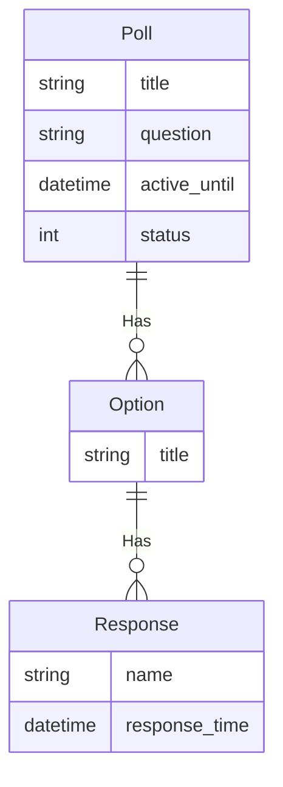

---
# Page title
title: The Poll Project 1st Assignment

# Title for the menu link if you wish to use a shorter link title, otherwise remove this option.
linktitle: 1st Assignment

# Date page published
date: 2021-04-25T11:12:25Z

# Academic page type (do not modify).
type: book

# Position of this page in the menu. Remove this option to sort alphabetically.
weight: 30

draft: False

---

{}
Due Date is <strong>Sunday May 9th before 1st lab</strong>
{}

## متطلبات هذه المهمة

- [ ] إعداد مشاريع جديدة للمهمة
- [ ] قم بإعداد تطبيق استطلاع في مشروعك
- [ ] قم بإنشاء نموذج لهذا المشروع بناءً على ER-Diagram الموضح أدناه
- [ ] إجراء migrations وإعداد قاعدة البيانات
- [ ] قم بإعداد واجهة الإدارة لهذا النموذج
- [ ] أنشئ بعض بيانات الاختبار المفيدة باستخدام واجهة الإدارة (3 أسئلة استطلاع مع عدد متفاوت من الردود لكل منها ، من 3 إلى 7)

### تحسين واجهة الإدارة بالميزات التالية: 

- [ ] عرض أسئلة الاستطلاع والتاريخ النشط والحالة على شكل قائمة
- [ ] السماح بالبحث في أسئلة الاستطلاع
- [ ] تصفية الأسئلة على أساس الحالة
- [ ] إظهار قائمة خيارات الاستطلاع التي تعرض سؤال وخيار الاستطلاع
- [ ] إظهار اسم الرد والوقت والخيار والاقتراع للردود 

### مهام إضافية

ستشمل هذه المهام قراءة وثائق Django واكتشاف الأشياء بنفسك. قم بإجراء هذه المهام فقط بعد إكمال المتطلبات السابقة للمهمة

- [ ] في قائمة أسئلة الاستطلاع، اعرض عمودًا يوضح عدد الردود على السؤال
- [ ] إنشاء InlineModelAdmin للاستطلاع والخيار الذي يسمح بتحرير وإنشاء السؤال والخيارات بنفس النموذج
- [ ]  استكشف واجهة الإدارة بنفسك وحاول تنفيذ ميزات جديدة

## ER-Diagram

يصف ER-Diagram متطلبات البيانات وسيتم استخدامه لإنشاء نماذج بيانات المشروع في Models.py. نموذج بيانات المدونة حاليًا بسيط جدًا ويحتوي على كيان واحد: 

