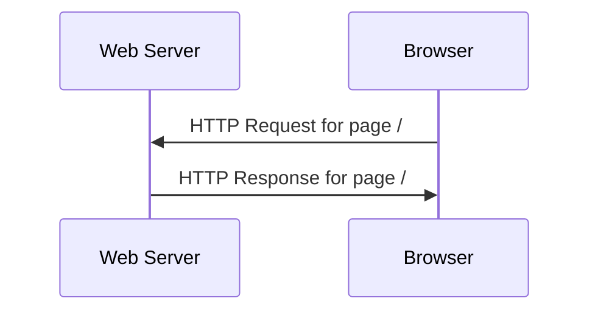
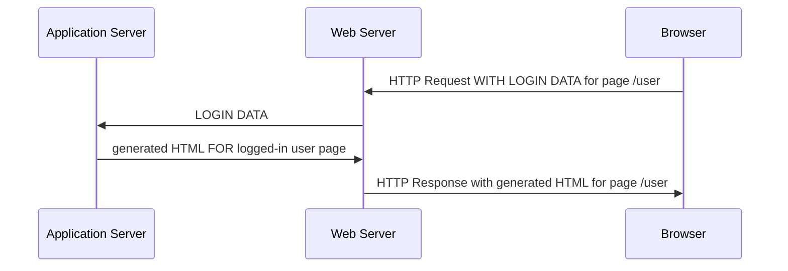
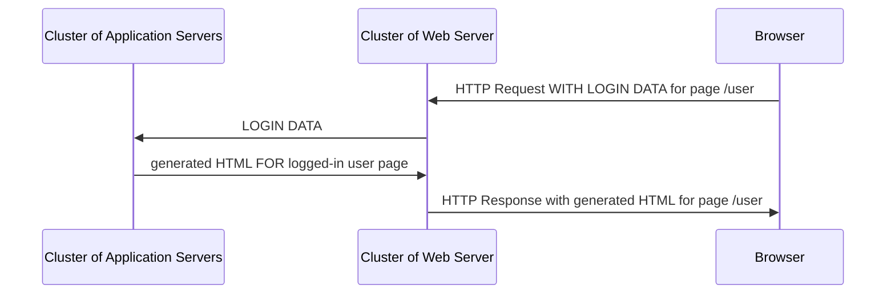
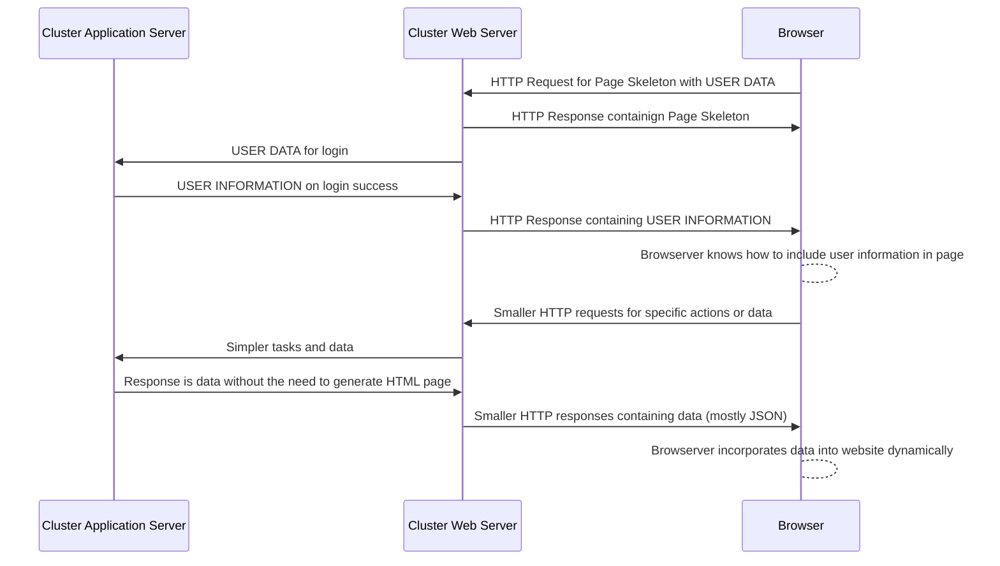

# ISOM 350
## Business Application Development

Mohammad AlMarzouq

Web Applications

---

## What Are Web Applications?

- Applications that run in the web browser. 
- Replacing desktop applications due to benefits
  
---

# Benefits of Web Applications

---

## 1. Interoperability 

- Browsers are available various phone and computer
- Apps can run on all devices with browsers
- Larger potential user base

---

## 2. Manageability

- The code is developed once and maintained centrally.
- Easy to update and secure.

---

## 3. Relative Security

- Security will always be a challenge
- Centrally managed servers with ability to monitor and update rapidly puts it at a **relative** advantage compared to  **server** based desktop applications. 
  
---

## 4. Rapid Improvement in tools and Capabilities

- Browser and web technology improving rapidly
- New features constantly introduced to these applications 
- Enables larger scale applications

---

# There Are Disadvantages Also

---

## 1. Complexity of Infrastructure
- Not just a matter of building the software.
- Building and managing complex infrastructure required
  - Web servers, applications servers, task queues, NOSQL data Stores, CDN, cloud infrastructure, load balancers ...etc
- Increased complexity with scale

---

## 2. Security and Privacy

- Larger scale means security incidents have greater impact
- Improvement in data management and analytics means customer privacy is eroded and privacy concerns need management.

---

## 3. Requires an Internet Connection

- Whether its a simple application or complex network application, web applications will always require the user to have an internet connection.
- Not significant concern at this age, but can be depending on requirements.

---

## 4. Rapid Improvement in tools and Capabilities
   
- This is actually both a benefit and a liability.
- Rapid technology improvements means current resources can be obsolete more rapidly.
- More investment in keeping up with advancements in web technology

---

# Evolution of The Web Application

---

## The Web Page

- Early days of the non-commercial internet
- Serving static content/files mainly for disseminating knowledge
- Main innovation was hyper text, which allowed linking of related documents
- Protocols included HTTP and HTML

---

### Web Page Infrastructure & Model



---

## Early Web Applications

- Improvements to HTTP protocol to allow browsers to submit information
- Two-way communication with users now possible.
- Enabled commercialization of the internet and building e-commerce websites
- More dynamic pages served, content of page fully loaded with every user action.

---

### Web Application Infrastructure & Model



---

## Web 2.0 Applications

- Web platforms leveraged users in generating the content:
  - e.g.:Wikipedia, twitter, facebook ..etc.
- Same infrastructure as previous era web application but at a much larger scale
  - Clusters of servers
- Impetus for new generation dynamic web applications of the next era

---

### Web 2.0 Infrastructure & Model



---

### Modern (HTML5) Web Applications 

- Emergence of the frontend application
  - **Fully dynamic:** No need to load the whole page on user actions
  - **Responsive:** displayed on tablets and phones as well.
- HTML5 technologies become mainstream
  - HTML, Javascript, and CSS
  - Emergence of modern HTML5 browsers


---

### Modern (HTML5) Web Applications 

- Development split into frontend user focused and backend data focused
- Shorter but frequent Request/Response 
  - Emergence of new HTTP/2 protocol
- Business logic distributed between server and client
  
---

## "Typical" HTML5 Instrastructure & Model

---



---

## The Infrastructure in the Cloud Era

- Components of the infrastructure are the same
- Change is that these components can be cloud based
  - Meaning, they can be rented as SaaS, IaaS, or PaaS.
- Cloud providers include Amazon, Digital Ocean, Microsoft Azure, and Cloudflare to name a few
- Infrastructure could be a mashups of services

---

## Main Components of The Web Infrastructure

---

## The Browser

- The client which initiates the HTTP request and displays the web application
- Request start with user typing the URL in the browser

---

## The Web Server

- Accepts HTTP requests from browsers then responds with an HTTP response containing the requested page or information
- Serves static files only
- Forwards requests for dynamic pages to the application server
- Receives content from application server and forwards it to the browser

---

## The Application Server

- Responsible for constructing the dynamic page
- Receives forwarded request from web server and determines what action to take based on the included information in the request
  - whether to login, purchase, update info ...etc

---

## The Application Server

- Actions or business logic is developed using modern programming languages like Python, Java, Ruby, JavaScript, C# ...etc
  - This is where Django fits in
- Not designed to handle static content
- Require preparing a test server when developing a web application and using a browser to test it

---


## The Request Response Cycle

Starts with user typing the URL, for example:

```
  http://www.twitter.com/signup
```

---

### The URL

```
  http://www.twitter.com/signup
```

- **http://** is the protocol part. 
- It's how the user tells the browser which protocol to use to communicate with the server. 
- Other common protocols that browsers can use include **https://** and **ftp://** 

---

### The URL

```
  http://www.twitter.com/signup
```

- **www.twitter.com** is the hostname part. 
- The **twitter.com** part from the hostname is known as the domain. 
- The hostname is an alias for the IP address of the server. 

---

### The URL

```
  http://www.twitter.com/signup
```
- **/signup** is known as the path. 
  - This determines what file or service we would like the web application or server to provide. 
- The **/** is known as the root path. 
- Each function/service in a web application **must** be associated with a unique path
  
---

## Simple GET Request Example

```
GET /hello.htm HTTP/1.1
User-Agent: Mozilla/4.0 (compatible; MSIE5.01; Windows NT)
Host: www.tutorialspoint.com
Accept-Language: en-us
Accept-Encoding: gzip, deflate
Connection: Keep-Alive
```

---

## The HTTP Response Example

```
HTTP/1.1 200 OK
Date: Mon, 27 Jul 2009 12:28:53 GMT
Server: Apache/2.2.14 (Win32)
Last-Modified: Wed, 22 Jul 2009 19:15:56 GMT
Content-Length: 88
Content-Type: text/html
Connection: Closed

<html>
<body>
<h1>Hello, World!</h1>
</body>
</html>
```

---

## POST Request Example

```
POST /cgi-bin/process.cgi HTTP/1.1
User-Agent: Mozilla/4.0 (compatible; MSIE5.01; Windows NT)
Host: www.tutorialspoint.com
Content-Type: application/x-www-form-urlencoded
Content-Length: length
Accept-Language: en-us
Accept-Encoding: gzip, deflate
Connection: Keep-Alive

licenseID=string&content=string&/paramsXML=string
```

---

- For a more detailed description of the HTTP protocol please [read this post](https://developer.mozilla.org/en-US/docs/Web/HTTP/Messages). 

- Understanding how HTTP works is key to understanding the security issues associated with web applications and to understand how to manage and scale web applications.

---

## The Protocols

---

## HTTP

- Hyper Text Transfer Protocol. 
- This is a clear text based protocol where client and server communicate using readable text.

---

## HTTPS

- Similar to HTTP, but the text is encrypted.

---

## SSL/TLS

- Two of the main protocols used for encrypting HTTPS communication text. 
- SSL stands for Secure Socket Layer and is the predecessor to TLS. 
- Now most websites use TLS, which stands for Transport Layer Security. 

---

## HTML

- Hyper Text Markup Language. 
- It is a language that is used to give a text document structure and also used to change text formatting, just like a word document. 
- HTML documents are text base and look something like the following:

---

```
 <!DOCTYPE html>
<html>
<body>

<h1>My First Heading</h1>
<p>My first paragraph.</p>

</body>
</html> 
```
---




---

## CSS

- Cascading Style Sheets. 
- It is the way in which to control the styles, colors, fonts and how the text looks in HTML pages. 
- Best practice is to use HTML to design the structure of the page, then setting the formatting and colors of the page using CSS.

---

- To further experiment and learn about HTML you can use this [HTML scratch pad](https://www.w3schools.com/html/tryit.asp?filename=tryhtml_basic_document) to experiment with writing HTML. 
- Use this [HTML tutorial](https://www.w3schools.com/html/) to learn what tags you can use.

---

### Where Does Django Fit In?

- Django is a python based web application framework. 
- It allows the user to easily handle HTTP requests and produce correct HTTP responses.
- It forces the developer to organize and write functions in a certain way
  - The developer gets many benefits for free if they follow these rules, such as improved security, templates, admin interface and more

---

### Who Is Using Django?

- Instagram
- Uber
- Pintrest
- Dropbox
- Netflix
- Reddit
- and many more

--- 

### Something To Keep In Mind

As a website grows and more engineers are hired to work on it, other technologies are utilized to manage the infrastructure. Therefore, we cannot say that these websites are built using only Django or Python

---

### In This Course

- We will only touch upon some of the features of Django. 
- Django can be as simple or complex as you want
- It can be the means to quickly build web application prototypes 
  - or engineer a complex solution that can serve large scale websites like twitter, facebook, or snapchat.
