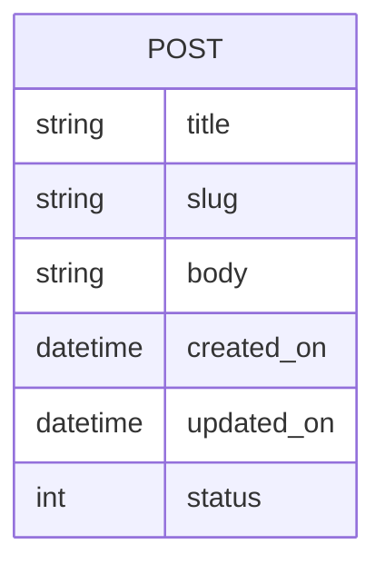

---
 # Page title
title: The Blog Project Models

# Title for the menu link if you wish to use a shorter link title, otherwise remove this option.
linktitle: Models 
# Date page published
date: 2021-03-23

# Academic page type (do not modify).
type: book

# Position of this page in the menu. Remove this option to sort alphabetically.
weight: 2

draft: False


---

{}
Switch to branch **2-models** from **malmarz/isom350-blog** github repo to see this step's implementation
{}

Let's create the models needed for our blog project based on the ER-Diagram of the project:



This is a simple project with a single entity called POST, where for each post we will store the title, slug (which is used to create a readable URL for the blog post), the body of the post, creation and update date, and finally the status. So let's open models.py and create the model:

```python
from django.db import models

class Post(models.Model):

```

Here we have created a Post model, which means we want a table to in our database to store information about posts. But we still haven't defined what we will store about the post. For that, we need to define fields within the post. A field would allow us to define the name and type of data we want to store from the post.

Based on the ER-Diagram, we know that we want to store the title of the post, which is a string. So let's look at what kind of [fields are available in Django Documentation](https://docs.djangoproject.com/en/3.1/ref/models/fields/). If you look at the right hand column of the django model fields documentation, you will see a list of the type of fields we can include in our model. Let's look for a field type that would allow us to store string data. You can see there are many types of fields, some for integers, images, or emails. The fields that would allow us to store strings are either [CharField](https://docs.djangoproject.com/en/3.1/ref/models/fields/#charfield) or [TextField](https://docs.djangoproject.com/en/3.1/ref/models/fields/#textfield). Both allow us to store string as part of our Post model. But upon reading their documentation, CharfField is more appropriate when storing strings that have limited length, while TextField is used if the strings are long or require unlimited length. Titles typically have a limited number of characters that might not exceed 200 characters. So let's add a title field of type character with a maximum character limit of 200 characters:

```python
from django.db import models

class Post(models.Model):
    title = models.CharField(max_length=200, unique=True)
```
Notice also how you can set additional options for the title. Here we chose that the title is unique, meaning, Django will prevent anyone from creating the same titles for two different posts. Field options can also be found in the [Django Model Fields Documentation](https://docs.djangoproject.com/en/3.1/ref/models/fields/). Be sure to carefully read them and configure your models in the way you would like them to behave.

Now let's complete the model definition for all other fields that we need by also referring to the documentation. We will end up with the following definition that matches our ER-Diagram:

```python
from django.db import models

class Post(models.Model):
  title = models.CharField(max_length=200, unique=True)
  slug = models.SlugField(max_length=200, unique=True)
  body = models.TextField()
  created_on = models.DateTimeField(auto_now_add=True)
  updated_on = models.DateTimeField(auto_now=True)
  status = models.IntegerField(default=0)
```

Notice however the field status. We want to limit the values of status to either 0 if the post is a draft, or 1 if the post is published. So we create the choices and configure the field to use these choices only. This will prevent anyone from entering values other than 0 or 1 for status:

```python
from django.db import models

 STATUS = (
    (0,"Draft"),
    (1,"Publish")
  )

class Post(models.Model):
  title = models.CharField(max_length=200, unique=True)
  slug = models.SlugField(max_length=200, unique=True)
  body = models.TextField()
  created_on = models.DateTimeField(auto_now_add=True)
  updated_on = models.DateTimeField(auto_now=True)
  status = models.IntegerField(choices=STATUS, default=0)
```

Finally, for the next step, we would like our model objects to display a useful message when we display them in the admin interface. Therefore, we must define a special function called **__str__**. We can set what is displayed when someone attempts to print an object of the Post model:

```python
from django.db import models

 STATUS = (
    (0,"Draft"),
    (1,"Publish")
  )

class Post(models.Model):
  title = models.CharField(max_length=200, unique=True)
  slug = models.SlugField(max_length=200, unique=True)
  body = models.TextField()
  created_on = models.DateTimeField(auto_now_add=True)
  updated_on = models.DateTimeField(auto_now=True)
  status = models.IntegerField(choices=STATUS, default=0)

   def __str__(self):
    return self.title
```

With that our model is complete and we can move to the next step of configuring the Admin Interface to manage these models. For more information please refer to [Django's documentation on database models](https://docs.djangoproject.com/en/3.1/topics/db/models/).

## Review Questions

- What are Django Models? What are they used for?
- How are Django Models related to ER-Diagrams?
- What is a model field? What is it used for? Can you name a few types?
