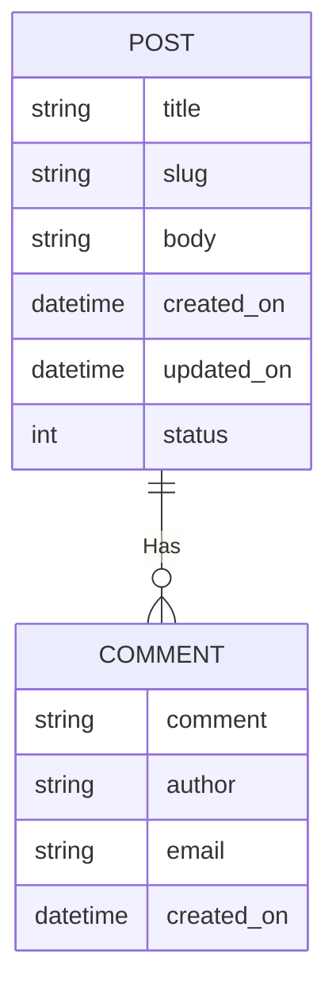

---
# Page title
title: Traversing Model Relationships

# Title for the menu link if you wish to use a shorter link title, otherwise remove this option.
linktitle: Model Relationships

# Date page published
date: 2021-03-23

# Academic page type (do not modify).
type: book

# Position of this page in the menu. Remove this option to sort alphabetically.
weight: 6

draft: true

---

## Updated Requirements for the Blog App

- Each blog post will have multiple comments
- Comment author will provide comment, optional name, and optional email
- Comments will be displayed along with author name in order below the post
- Date/Time of comment will be displayed next to it
- Number of comments and date/time of latest comment will be shown next to each post in post list

### Updated ERD

### Implementing The Changes

## Final Thoughts

- 

## Review Questions and Challenges

- 

