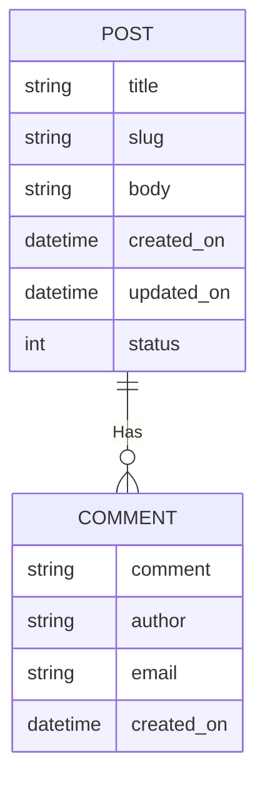

---
# Page title
title: Traversing Model Relationships

# Title for the menu link if you wish to use a shorter link title, otherwise remove this option.
linktitle: Model Relationships

# Date page published
date: 2021-03-23

# Academic page type (do not modify).
type: book

# Position of this page in the menu. Remove this option to sort alphabetically.
weight: 9

draft: false


---


## Updated Requirements for the Blog App

- Each blog post will have multiple comments
- Comment author will provide comment, optional name, and optional email
- Comments will be displayed along with author name in order below the post
- Date/Time of comment will be displayed next to it
- Number of comments and date/time of latest comment will be shown next to each post in post list

### Updated ERD



### Implementing The Changes

Let's update the our `/blog/models.py` first:

```python
class Comment(models.Model):
  comment = models.TextField()
  author = models.CharField(max_length=100, blank=True, null=True)
  email = models.EmailField(blank=True, null=True)
  created_on = models.DateTimeField(auto_now_add=True)
  post = models.ForeignKey('Post', on_delete=models.CASCADE) 
```

Since we made a change to our models and to apply the changes to the database, we must run in shell:

```bash
python manage.py makemigrations
```

then:
```bash
python manage.py migrate
```

Now let's update the admin so we can add comments to our posts using an InlinePostAdmin in `blog/admin.py`:

```python
# Import Comment as well
from .models import Post, Comment

# add the following
class CommentInline(admin.TabularInline):
  model = Comment

# update the following admin
class PostAdmin(admin.ModelAdmin):
    # other configurations here ...
    # add the following to PostAdmin
    inlines = [CommentInline,]
```

### Updating the Detailed Post View to Show Comments

Remember, comments are related in a 1-to-many relationship with Posts. This is illustrated in the ERD as well as the `ForeignKey` field in the Comment model that links it to the Post model.

The ForeignKey is always placed on the many side of the relationship. This means the following:
- Any single Comment must be related to a single Post (becasue the foregnkey field is in Comment)
- Any single Post could has multiple comments associated to it

In our `show_post` view we created in the previous section, we fetched a single Post object:

```python
def show_post(request, id):
  obj = Post.objects.get(slug=id)
  context = {
    'post': obj, # The post slot has a single post
  }
  return render(request, "post_detail.html", context)
```

Let's updated it to fetch the comments related to that post that we fetched:

```python
def show_post(request, id):
  obj = Post.objects.get(slug=id)
  comment_list = obj.comment_set.all() #1
  context = {
    'post': obj, 
    'comments': comment_list, #2
  }
  return render(request, "post_detail.html", context)
```
Code explanation:

- **Line #1:** Notice here that we did the query on the variable containing the post object `obj`. Instead of using `objects` we used `comment_set` model manager. This is a model manager that is automatically created on any model that has a ForeignKey pointing to it from another model and would take the name of the model pointing to it. So, because `Comment` model has the ForeignKey pointing to Post, this manager is automatically named `comment_set`. This is called the reverse relationship manager. So `obj.comment_set` will allow us to perform query operations on all the comments associated with that specific post object. Everything you have learned so far on database queries applies here. You can use `all` or `filter`. Here we are using `all` to fetch all the comments associated with the post and stored them in the `comment_list` variable.
- **Line #2:** We are storing the contents of `comment_list` variable (which is a list of comments) into the `comments` slot in the context. Now our template will have a variable named `comments` that has a list of comments that we can loop over and display.

Let's update the `post_detail.html` template to loop over and dipsplay our comments:

```html
 <h1>{{ post.title}}</h1>
  <ul>
    <li>Posted on: {{ post.created_on }} </li>
    <li>Last updated: {{ post.updated_on }} </li>
  </ul>
  <p>
    {{ post.body }}
  </p>
  <h2>comments:</h2>
  <ul>
  
    <li>{{ c.author }}: {{ c.comment }}</li>
  
  </ul>
```

Pay attention specifically to this part:

```html
  <ul>
  
    <li>{{ c.author }}: {{ c.comment }}</li>
  
  </ul>
```

As we did in post lists, we looped over the comments template variable and displayed each comment as a list item. This is the end result:



---

## Final Thoughts

- If you have a Post object called `obj`, you can easily get to the associated Post directly using the ForeignKey field. So `obj.post` would give you the post object.
- The reverse relationship manager is always named `model_set`, just replace the model with the name of the model that has the ForeignKey.
- You can change the name of the reverse relationship manager using the option `related_field` in the ForeignKey and tell Django if you want to name the manager a name other than the `model_set` name.


## Review Questions and Challenges

- What is a reverse model manager?
- Try to filter the comments related to a post such that you would only show the comments in which the name is not empty


