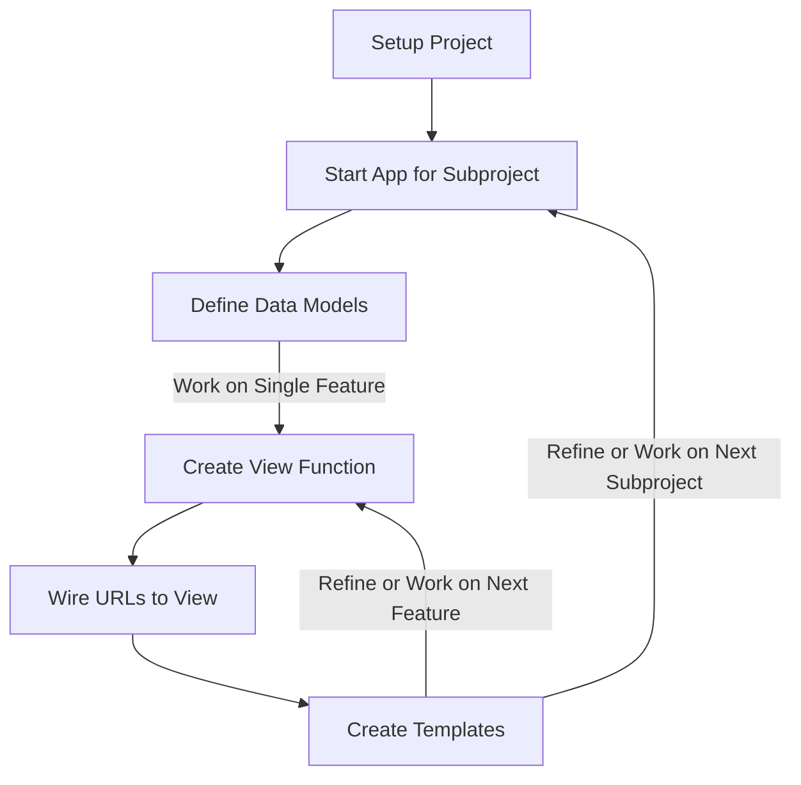

---
# Page title
title: The Django Development Process

# Title for the menu link if you wish to use a shorter link title, otherwise remove this option.
linktitle: Django Development Process

# Date page published
date: 2021-03-23

# Academic page type (do not modify).
type: book

# Position of this page in the menu. Remove this option to sort alphabetically.
weight: 6

draft: False

---
## What is Django?

Django is a web application development framework. Meaning, it is a set of rules, libraries, and conventions that you could use to streamline the process of building a web application.

Given that Django is a framework, it enforces a number of restrictions and ways to do things on our proejct. These restrictions would guarantee that we can gain the benefits promised by Django including improved collaboration, security, admin interface, reusability ...etc.

## The Steps in the Development Process

Another benefit to adhering to the Django way of doing things is that it makes the development process more predictable. If the functional and data requirements are already known, then the way in which development is done is as follows:

## The Steps
### 1- Setup Project
The setup project step is done only once at the start of the project. It creates the source code directory structure for the django project. It is performed by creating a **Django Template** project in replit.com. When the project is created it will have the following structure:



The most important files are:
1. **manage.py:** This is used to execute project commands, such as creating apps, running the django server, and creating a superuser.
2. **urls.py:** This is the main file which describes what the paths the web application will contain. Typically, each path will point to a single feature.
3. **settings.py:** This is where all the project configuration will reside. This will be need modification when starting the project for the first time.

To confirm that your setup works on replit.com, click on the Run button up top, and you should see the following in your browser:



You are ready to start working on your Django project if you see this screen, and remember, the development Django server must be running for you to see your work. To stop the server, you need to click the Stop button up top.

It is highlly recommended that you open the webserver in it's own browser window. This would allow you to easily navigate your web application by entering different URLs to test different parts of the application.

### 2- Start App or Subproject
### 3- Define Data Models
### 4- Create View Function
### 5- Wire URLs
### 6- Create Template

