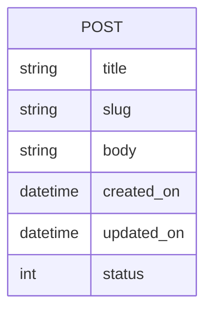

---
# Page title
title: ISOM 350 Introduction

# Title for the menu link if you wish to use a shorter link title, otherwise remove this option.
linktitle: Introduction

# Date page published
date: 2021-03-23

# Academic page type (do not modify).
type: book

# Position of this page in the menu. Remove this option to sort alphabetically.
weight: 1

draft: False

# Featured image
# To use, place an image named `featured.jpg/png` in your page's folder.
# Placement options: 1 = Full column width, 2 = Out-set, 3 = Screen-width
# Focal point options: Smart, Center, TopLeft, Top, TopRight, Left, Right, BottomLeft, Bottom, BottomRight
# Set `preview_only` to `true` to just use the image for thumbnails.
image:
  placement: 1
  caption: "Python logo"
  focal_point: "smart"
  preview_only: false
  alt_text: Python logo

---

## Requirements

- [ ] Blogger can post on blog where text, title, and time of posting is shown
- [ ] Blog post can be draft or published
- [ ] Blog posts will have titles, readable urls (called slugs and generated from title), a body, and will show the date and time it was created and edited
- [ ] Blogger can edit blog posts and system will show last time it was updated
- [ ] Website will show a list of blogposts with summary of the body
- [ ] User can select a post from the list of blog posts to view the details
- [ ] Assume there is a single author for all blog posts that never change 

#### Some Useful Tips

- Consider the requirements as a checklist that you check everytime you complete one. When you have completed all requirements then your project is complete. 
- For most requirements, you will go through the the process described in the [Django Development Process]()

## ER-Diagram

The ER-Diagram describes the data requirements and will be used for constructing the project's data models in models.py. The blog data model is currently very simple and contains a single entity:

