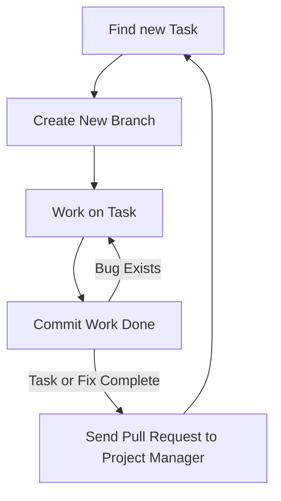

---
# Page title
title: Development Collaboration

# Title for the menu link if you wish to use a shorter link title, otherwise remove this option.
linktitle: Collaboration

# Date page published
date: 2021-03-23

# Academic page type (do not modify).
type: book

# Position of this page in the menu. Remove this option to sort alphabetically.
weight: 3

draft: False

---

One of the most challenging aspects of software development is working effectively as part of a team. This problem is even more pronounced for inexperienced programmers because the way the code is organized will impact how well the team can collaborate. Fortunately we are using Django, so the way our code will be organized has already been decided for us. Django projects are organized to take advantage of OOP and enable effective teamwork. What remains is how team members can share their work together and combine it into a single code base (or project).

There are two ways in which team members can collaborate or work together:

# 1- Synchronous Collaboration

In synchronous collaboration, the collaborating team members would all be online at the same time and work on the same file together. Such collaboration is easily enabled by replit.com and only requires that members share the link to the project they are working on. Replit.com does a good job of allowing team members to change the same file at the same time and communicate in realtime as they do so.

However, such collaboration has limitations:
1. Requires schedule coordination
2. Limited number of collaborators, ideally it makes sense to have 2 work together synchronously.
3. Contribution of members not tracked
4. Might require the availability of at least one experienced team member to succeed.

The main benefit of synchronous communication is **Knowledge Sharing**. The collaborators would work together on problem solving and the less experienced one would be learning greatly from the person they are collaborating with. Synchronous collaboration is similar is essence to eXprogramming.

## How to Use Synchronous Collaboration on Replit.com?

There are two main methods:

1. Create a team repl as part of the [MISCBA team on replit.com](https://replit.com/team/miscba) called a **multiplayer repl**:



then share the repl url from the browser:



2. Alternatively, you can create a regular repl but add collaborators using the share button:



# 2- Asynchronous Collaboration

In asynchronous collaboration, each member of the collaborating team would work on the project in their own time and do not need to interact directly with other team members. Instead, a system is used to manage how each member changes the code of the project and to enable the consolidation of work from multiple members into a single code base. This is by far the most effective and widely used method of collaboration in programming. Currently, the most popular system used to manage synchronous collaboration is git, which is provided by github.com.

Using git, or github will require developers to learn a new tool that might not be easy to learn at first. But once the developers use the tool correctly, it is possible to enable the collaboration of thousands of developers on a single project, as can be seen in the [linux kernal project](https://github.com/torvalds/linux).

Fortunately, replit.com integrates well with github. We will be using the main git features from within replite.com, and for other tasks such as merging  and resolving conflicts, we will use the web interface provided by github.com to perform these collaboration related tasks.

Using github is not sufficient for collaborating effectively. To be effective, the following conditions must be met:
1. Code organized to enable collaboration (Django forces that on the project in the way it organizes the code)
2. Team must agree on a workflow that describes how each member will start work, what to work on, and how to share it when done.
3. All team members must adhere to the workflow when coding for the project.

## Our Workflow

Each team will have their own workflow, and so we will be recommended a workflow for you to use in this course. The workflow is as follows:

**A task** could be creating a new feature or fixing an existing bug. The workflow describes how developers should behave when they work on a task. The main steps are:

1. **Find a task or fix to work on:** It is the responsibility of the project manager to ensure that developers can find tasks to work on. These can be found listed on GitHub issues, the ticketing system used for the project, speaking to the project manager, or reading the requirements document. For this course, project managers should write down tasks as issues in GitHub. Developers can also assist by writing issues that can either bew feature suggestions or descriptions of bugs that need to be fixed. We will discuss project management in more detail in [the next section]().
2. **Create a new branch:** Branches allow a developer to change the code without fear of ruining the project. When starting on a programming task, always create a new git branch for the task from the master branch. A branch allows you to change the code for you only, and not affect the work of others. You need to always remember the following:
   - **NEVER work directly on the master branch**. 
   - **Create a new branch** from the master branch only.
   - The Master branch **should always** have a working copy of the project, never a broken one.
   - **Choose a name** for the new branch that reflects what work is done. For example bug_1234, where the number is the issue number on github. Or feature_1234. To learn about what characters are allowed in a branch name [please read this article](https://git-scm.com/docs/git-check-ref-format).



3. **Working on the task**: Ensure that the task you are working on is small and simple. If there are large and complex tasks, break them down into smaller tasks.
4. **Commit the task**: Upon completion of the task, or reaching a milestone in your work, you must commit the work. This would allow you to create a snapshot of the work you did to be stored in the github history. The advantage of having a commit snapshot is that you can return to this versino of the code any time. Therefore, it is recommended to commit frequently and even for small changes. Just make sure when you commit that you write a useful message for the history to know what you did in that commit. You must always commit and test your work and continue to change the code and commit until you are sure that the changes you did are acceptable and the task is complete.
5. **Send a pull request**: If you are sure the task is complete then use github to send a pull request. The pull request tells the project manager that the work on this branch is complete and ready to be added to the master branch. It is the responsibility of the project manager to respond to the pull request and merge it into the master branch. Pull requests are created from github.com.

Everyone is expected to follow these steps whenever you work on development projects in this course. It might seem like an overhead at first, and you will not see the benefits right away. However, the goal is to get you to practice how to code as part of a team. So when you start your final project, you will start to see the benefits of this workflow.