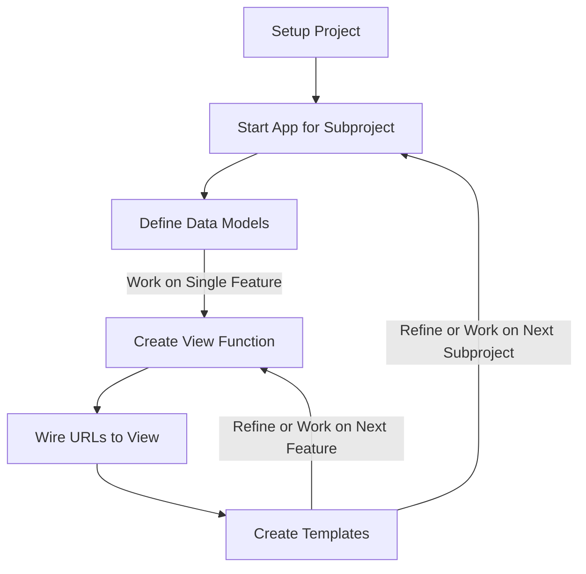

---
# Page title
title: The Django Development Process

# Title for the menu link if you wish to use a shorter link title, otherwise remove this option.
linktitle: Django Development Process

# Date page published
date: 2021-03-23

# Academic page type (do not modify).
type: book

# Position of this page in the menu. Remove this option to sort alphabetically.
weight: 6

draft: False


---
## What is Django?

Django is a web application development framework. Meaning, it is a set of rules, libraries, and conventions that you could use to streamline the process of building a web application.

Given that Django is a framework, it enforces a number of restrictions and ways to do things on our project. These restrictions would guarantee that we can gain the benefits promised by Django including improved collaboration, security, admin interface, reusability ...etc.

Django is classified as a fullstack framework that provides all the necessary libraries needed to build a web application from database abstraction to templating and everything in between. The alternative type of web frameworks are micro frameworks that specialize in a specific functionality of a web application. Flask is an example of a micro web framework that specializes in building view functions for handling HTTP requests. For templating or databases you have to use other libraries that can assist with these tasks such as Jinja for templating and SQLLAlchemy for databases.

## The Steps in the Development Process

Another benefit to adhering to the Django way of doing things is that it makes the development process more predictable. If the functional and data requirements are already known, then the way in which development is done is as follows:



## The Steps
### 1- Setup Project
The setup project step is done only once at the start of the project. It creates the source code directory structure for the django project. There are three main methods to create a Django project:

1. **(Recommended for this course)** Creating a **Django Template** project in replit.com. 



2. Importing an existing Django project from GitHub. GitHub project can be a new Django project or forked from a Django project. Use this option when you want to collaborate on an existing project.
3. Using **shell** you type a command to create a Django project. **Works only if Django is already installed on your PC or repl, a bit advanced, so avoid using this course**. This is the shell command:

```
$ django-admin startproject name-of-project
```

When the project is created it will have the following structure:



The most important files are:
1. **manage.py:** This is used to execute project commands, such as creating apps, running the django server, and creating a superuser.
2. **urls.py:** This is the main file which describes what the paths the web application will contain. Typically, each path will point to a single feature.
3. **settings.py:** This is where all the project configuration will reside. This will be need modification when starting the project for the first time.

To confirm that your setup works on replit.com, click on the Run button up top, and you should see the following in your browser:



You are ready to start working on your Django project if you see this screen, and remember, the development Django server must be running for you to see your work. To stop the server, you need to click the Stop button up top.

It is highly recommended that you open the webserver in it's own browser window. This would allow you to easily navigate your web application by entering different URLs to test different parts of the application.

### 2- Start App or Subproject

All code is organized into directories called apps. The first step in any project is to setup the directory structure for the source code files. Django has a very particular way in which files must be organized. It also requires that we put code related for different functionality in specific files. For example, database related code is usually placed in models.py, and http related functionality in views.py and so on. 

The organizational unit for Django functionality is an App. It is a directory containing related source code to serve a specific function in the web application. Every project must have at least a single app directory to hold the functionality created by the developer. Django provides a number of shell commands to generate the directory structure needed for a project so that developers might start their projects easily. We will discuss this step in more detail in our sample project, but keep in mind that this step is necessary and is done once at the start of the project.



### 3- Define Data Models

Data models describe how the data in your project looks like. If you have completed a Systems Analysis and Design course, it is what you implement as a result of the ER-Diagram you develop in the data requirements gathering stage. ER-Diagrams describe entities that correspond to relational database tables. With each entity having fields that correspond to table columns in the relational database. **An entity** is something you want to gather information on, for example, a student. A field is the information you gather on that entity, for example the student name and student civil id are all examples of fields.

A model in Django also corresponds to a relational database table as Django will create a table for every model you have in models.py. Therefore, all your entities in your design must have a corresponding model in your models.py. The django model will have fields that django will create a column in the corresponding table for that model. The following is an example of a models.py file in Django:

```python
from django.db import models

class Author(models.Model):
    first_name = models.CharField(max_length=50)
    last_name = models.CharField(max_length=50)
    country = models.CharField(max_length=100)

class Book(models.Model):
    artist = models.ForeignKey(Musician, on_delete=models.CASCADE)
    title = models.CharField(max_length=100)
    release_date = models.DateField()
    num_stars = models.IntegerField()

```


Without defining a models.py, you will not be able to store the data for your application and keep it persistent. For example, you might need to store usernames and passwords. Therefore, there must be a User model that has a username field and a password field. This means that you will store a username and password for every user in your database. **A single record containing a username and a password for one user is known as an object**. Having a User model defined means that we want to store many User objects (or records), one for each user using our web application.

By following the rules Django placed on creating models you will get numerous extra benefits, like the ability to manage all data using a web interface that Django created for you automatically. You also get the ability to user different databases with you web application simply by changing the database configuration in your mysite/settings.py file. Django also provides the ability to query the database and return data objects that meet certain criteria.

Once our data requirements are defined in models.py, we can move to the next step of actually building functionality for our web application.

### 4- Create View Function

A view function is how we create functionality in Django. A view function is a function whose first parameter is an HTTP Request. Django will use these functions to forward HTTP requests to our code using this first argument in the function where we can write code to process it and perform the tasks of the web application.

The second requirement of the view function is that it must return an HTTP Response. Django provide some convenience functions that make constructing responses easy for the developer. Failure to meat these two conditions when defining a view function means that Django will not be able to run the function correctly.

The third requirement is more of a guideline or a convention, where these functions are placed in views.py. It is possible to place them elsewhere, but Django developers have come to expect to find the functionality of a Django web application placed in views.py. I would highly recommend you stick to this convention. The following is an example of a simple view function used to return an HTML page showing the current time:

```python
from django.http import HttpResponse
import datetime

def current_datetime(request):
    now = datetime.datetime.now()
    html = "<html><body>It is now %s.</body></html>" % now
    return HttpResponse(html)
```

Once a view function is constructed, you can use the Python command line interface to test these functions and make sure they perform the right tasks. The function will not be availble to users of the web application unless you follow the requirements of the next step.


### 5- Wire URLs

This step involves assigning a path to the view function we created. For example, if you have an authenticate_user view function that check if a user is authorized to use the webb application or not, you might want the users to go to /auth path in their browser. This step involves mapping the view functions you have created to a path, this way Django knows which function to run based on the path that is opened by the browser.

Mapping urls is done in the urls.py file found in the mysite project directory, along with the settings.py file. The following is an example of the URL mapping for the view function we created in the previous section where the current time is shown:

```python
from django.urls import include, path
# Import the view function we created
from timeapp.views import current_datetime 

urlpatterns = [
    # Mapp the path time/ to the view function current_datetime
    path('time/', current_datetime, name='current-time'),
]
```

### 6- Create Template

Typically, designers and developers colalborate on building web applications. Designers focus on how the web application looks like and work mainly with HTML and CSS. While developers work with Django models and view functions. The template is what brings the work of these two members of the team together.

A template is simply a text or HTML file with placeholders, just like the curly brackets in python fstrings but templates use double curly brackets to include placeholders. One of the tasks of the view function is to pass all the variables that were created in the view function (known as the context) to the django template system, and the template system plugs the values of these variable in the correct placeholders to generate an HTML specific to that request.

If we continue our username and password example, after the user logged in we might retrieve the following information that we want to display to the user:
- Username
- email
- last login date
- User balance

The view function sends these values to the template system, where designers have created the good looking HTML page and specified the placeholders for where all this information should be displayed, and the HTML page with the information is generated from this process. The view function then includes this HTML page with the response so it can be displayed to the user.

The following is an example of a view function utilizing the templating system to automatically generate an HTTP response based on the template:
```python
from django.shortcuts import render

from .models import Question


def index(request):
    latest_question_list = Question.objects.order_by('-pub_date')[:5]
    context = {'latest_question': latest_question_list}
    return render(request, 'polls/index.html', context)
```

The template file would be an html file that looks like this, where you can see that you can include conditional logic to display parts of the document if data exists or not. In tour example, if the latest_question exists, it will display a link to it. Otherwise, a message that *no polls are available* is displayed to the user:

```
<html>
    <body>
    
        <ul>
            <li><a href="/polls/{{ latest_question.id }}/">{{ latest_question.question_text }}</a></li>
        </ul>
    
        <p>No polls are available.</p>
    
    </body>
</html>
```


Developers would go through this cycle for each function that is to be developed in this application. Therefore, if there was a team of developers working together on the application, typically, each developer would work on a separate function and later combine their work once they complete that function, then start working on the other.

