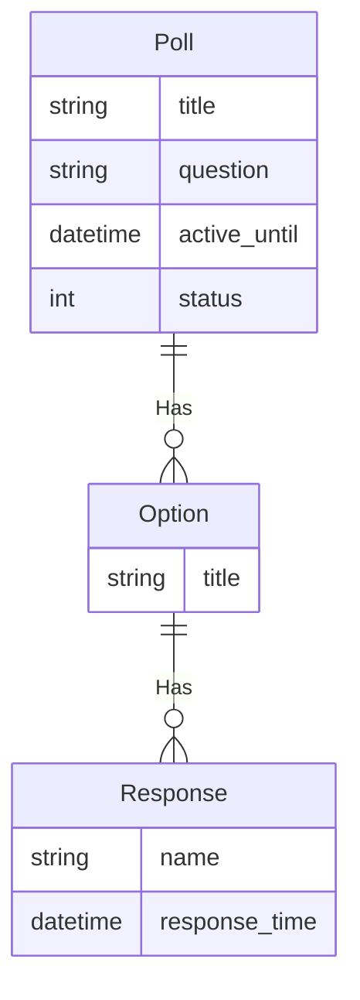

---

# Page title
العنوان: مهمة مشروع الاستطلاع

# Title for the menu link if you wish to use a shorter link title, otherwise remove this option.
اسم الرابط: مشروع الاستطلاع

# Date page published
التاريخ: 2021-03-23

# Academic page type (do not modify).
type: book

# Position of this page in the menu. Remove this option to sort alphabetically.
weight: 30

draft: لا

---

ستكون مهمتك الرئيسية هي مشروع تعيين الاستطلاع هذا ومن المتوقع أن تعمل بشكل فردي في المشروع

كل أسبوع ، سأحدد بعض المتطلبات التي تحتاج إلى إكمالها قبل تاريخ الاستحقاق وإرسالها من خلال موقع  
replit.com

ستمنحك التفاصيل هنا فكرة عامة عن ماهية المشروع في حالة رغبتك في البدء مبكرًا في العمل على المشروع. سأقدم أيضًا بعض النصائح هنا أثناء تقدمنا.

## المستخدمين
- **المستخدم: **الشخص الذي ينشر استطلاعات الرأي
- **المستجيب: **الشخص الذي يستجيب لاستطلاعات الرأي ويعرض النتائج

## متطلبات

- [] يمكن للمستخدم إرسال أسئلة الاستطلاع.
- [] يمكن أن يكون سؤال الاستطلاع نشطًا أو غير نشط
- [] سيكون لسؤال الاستطلاع العنوان والسؤال والتاريخ النشط حتى تاريخه والردود.
- [] يمكن للمستخدم إنشاء / تعديل / حذف أسئلة الاستطلاع باستخدام واجهة المسؤول
- [] سيعرض موقع الويب قائمة باستطلاعات الرأي النشطة مع ملخص يوضح عدد المستجيبين.
- [] سيعرض موقع الويب قائمة باستطلاعات الرأي غير النشطة مع ملخص يوضح عدد المستجيبين.
- [] يعتبر الاستطلاع غير نشط إذا تم تعيينه صراحة على "غير نشط" أو إذا انقضى تاريخ 
- active_until.
- [] يمكن للمستجيبين عرض نتائج الاستطلاع لاستطلاعات الرأي النشطة أو غير النشطة
- [] يمكن للمستجيبين فقط الرد على استطلاعات الرأي النشطة وإلا يتم تعطيل الاستطلاع برسالة تظهر أن الاستطلاع غير نشط
- [] خيارات الاستجابة ليست سوى خيارات متعددة.
- [] يمكن للمستجيبين تقديم أسمائهم أو عدم الكشف عن هويتهم
- [] سيتم تسجيل وقت الاستجابة لكل إجابة.
- [] يمكن عرض نتائج الاستطلاع على أنها أعداد رقمية أو مخطط شريطي أو مخطط دائري.

## ER- الرسم البياني

يصف مخطط ER- متطلبات البيانات وسيتم استخدامه لإنشاء نماذج بيانات المشروع في Models.py. نموذج بيانات المدونة حاليًا بسيط جدًا ويحتوي على كيان واحد:

