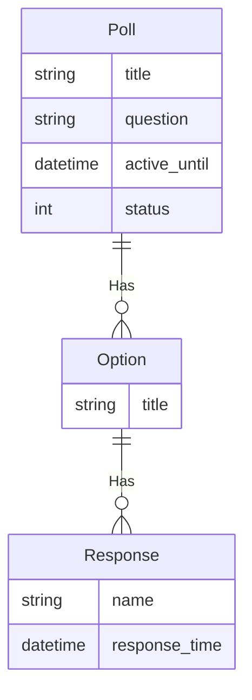

---
# Page title
title: The Poll Project Assignment

# Title for the menu link if you wish to use a shorter link title, otherwise remove this option.
linktitle: The Poll Project Assignment

# Date page published
date: 2021-03-23

# Academic page type (do not modify).
type: book

# Position of this page in the menu. Remove this option to sort alphabetically.
weight: 30

draft: False

---

Your main assignment will be this poll assignment project. You are expected to work individually on this project.

Every couple of weeks, I will specify some requirements that you need to complete before the due date and submit through replit.com.

The details here will give you a general idea of what the project is incase you want to get an early start on working on the project. I will also be providing some tip here as we progress.

## Users
- **User:** Person who posts polls.
- **Respondant:** Person who responds to polls and view results

## Requirements

- [ ] User can post a poll questions.
- [ ] Poll question can be active or inactive
- [ ] Poll question will have title, question, active_until date, and responses.
- [ ] User can create/edit/delete Poll questions using Admin interface
- [ ] Website will show a list of active polls with a summary showing number of respondents.
- [ ] Website will show a list of inactive polls with a summary showing number of respondents.
- [ ] Poll is considered inactive if explicitly set to inactive or if active_until date has passed.
- [ ] Respondents can view poll results for active or inactive polls
- [ ] Respondents can only respond to active polls otherwise the poll is disabled with message showing that poll is inactive
- [ ] Response options are only multiple choice.
- [ ] Respondents can provide their names or remain anonymous
- [ ] Time of response will be recorded for every response.
- [ ] Poll results can be viewed as numeric counts, bar chart, or pie chart.

## ER-Diagram

The ER-Diagram describes the data requirements and will be used for constructing the project's data models in models.py. The blog data model is currently very simple and contains a single entity:

