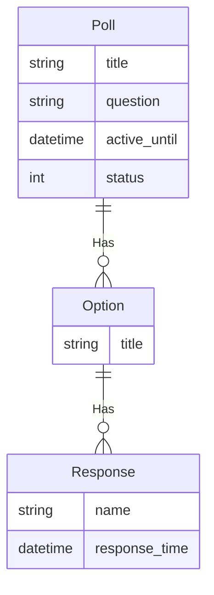

---
# Page title
title: The Poll Project 1st Assignment

# Title for the menu link if you wish to use a shorter link title, otherwise remove this option.
linktitle: Part 1

# Date page published
date: 2021-04-25T11:12:25Z

# Academic page type (do not modify).
type: book

# Position of this page in the menu. Remove this option to sort alphabetically.
weight: 30

draft: False

---

{}
Due Date is <strong>Sunday May 9th before 1st lab</strong>
{}

## Requirements for This Assignments 

- [ ] Setup a new projects for the assignment 
- [ ] Setup a poll app in your project
- [ ] Create the models for this project based on the ER-Diagram shown below
- [ ] Perform migrations and prepare the database
- [ ] Prepare the admin interface for these model
- [ ] Create some useful test data using the admin interface (3 poll questions with varying number of responses each, from 3 to 7)

### Improve Admin Interface with Following Features:

- [ ] Show poll questions, active date, and statue as a list
- [ ] Allow for searching poll questions
- [ ] Filter questions based on status
- [ ] Show Poll option list showing poll question and option
- [ ] Show response name, time, option, and poll for responses.

### Bonus Tasks

These tasks will involve reading the Django documentation and figuring out things on your own. Perform these tasks only after you complete the previous requirements of the assignment.

- [ ] In the poll question list, display a column showing the number of responses for the question
- [ ] Create InlineModelAdmin for Poll and Option which allows editing and creating of the question and options in the same form
- [ ] Explore the admin interface on your own and try to implement new features

## ER-Diagram

The ER-Diagram describes the data requirements and will be used for constructing the project's data models in models.py. The blog data model is currently very simple and contains a single entity:

## How to Start and Submit Your Project

1. Join the [poll-project assignment on github classroom](https://classroom.github.com/a/gJ3IhL4C).
2. Import your assignment repository to replit.com work on the main/master branch.
3. Add the file bonus.md and list all the additional bonus tasks you completed in your assignment.
4. Create a super user named `test` with password `1234` 
5. When done, commit and push your work to GitHub. You can continue to make changes and push code after submission.
