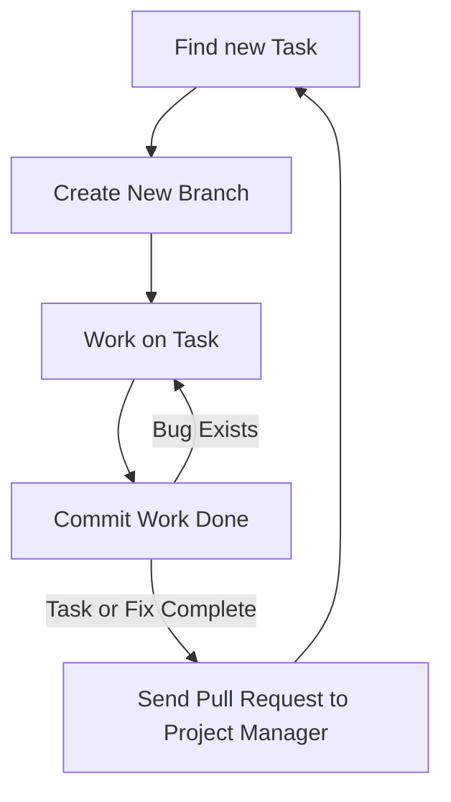

# ISOM 350
## Business Application Development

Mohammad AlMarzouq

Collaboration in Software Development

---

## Types of Collaboration

- Synchronous
- Asynchronous

---

## Synchronous Collaboration

- Developer working together on the same file at the same time
- Enabled using replit.com multiplayer repls
- Great for knowledge sharing
  - A form of eXprogramming

--- 

## Synchronous Collaboration Limitation

- Requires time scheduling
- Limited number of participants (Usually 2)
- Member contribution not tracked

---

## Asynchronous Collaboration

- Developers working together over time
- Enabled using Git and GitHub
  - Integrated with replit.com
- Requires agreement on workflow
- Better fit for large group collaboration and effort tracking

---

## Asynchronous Collaboration Limitations

- Steep learning curve
- Overhead to using the tools
  - Greater benefits with larger groups
  - Still useful for individuals
- Benefit of using collaboration tools might not be clear
- Success dependent on choice from endless workflows

--- 

## Class Workflow

