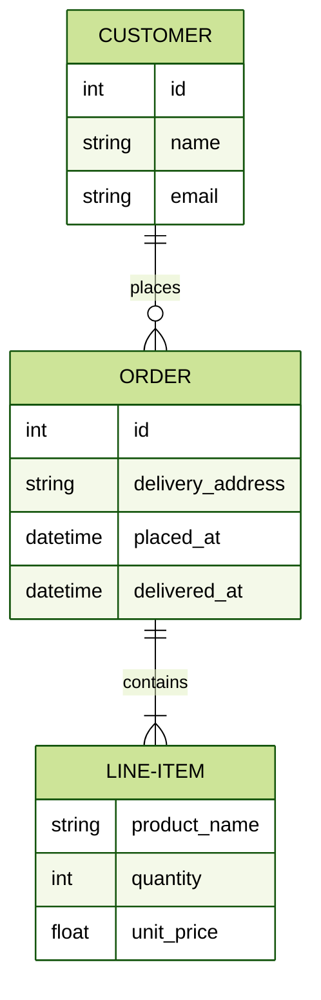

# ISOM 350
## Business Application Development

Mohammad AlMarzouq

Django Data Models

---

## What Are Django Models?

- Part of the Object-Relational Mapper (ORM)
- The ORM maps:
  - Data classes to relational database tables
  - Data objects to rows in rational tables
- Abstract database connections and queries
  - Can connect to different db types
  - You can write queries in Python

---

## Creating Models

- Subclass django.db.models.Model
  - Gives the db functionality to our class
- Each attribute is a model Field
  - Used to configure the properties of our data

--- 

## Creating Models

- Start with the ER-Diagram
- Implement entities as models
- Implement attributes of entities as fields in models
- Relationships have special field types to represent them

---

## Example ERD




---

## Customer Model

```python
from django.db import models

class Customer(models.Model):
    name = models.CharField(max_length=50)
    email = models.EmailField()
```
- Where is the id?
- What about the relationship?
- [What Field types are available?](https://docs.djangoproject.com/en/3.1/ref/models/fields/)

---

## Order Model

```python
class Order(models.Model):
    delivery_address = models.CharField(max_length=100)
    placed_at = models.DateTimeField(auto_now_add=True)
    delivered_at = models.DateTimeField(null=True, blank=True)
    placed_by = models.ForeignKey(
        'Customer',
        on_delete=models.CASCADE,
    )
```
- REMEMBER: One to many relationship always placed on the many side!

---

## Order Model

- DateTimeField Vs DateField
- auto_now_add Vs auto_now
  - auto_now_add: Set date/time to now upon creation
  - auto_now: Update date/time with every dave
- null vs blank
  - null: What can be stored in db
  - blank: Using for input validation (in forms)

---

## LineItem Model

```python
class LineItem(models.Model):
    quantity = models.IntegerField(default=0)
    product_name = models.CharField(max_length=100)
    unit_price = models.FloatField(default=0)
    contained_in = models.ForeignKey(
        'Order',
        on_delete=models.CASCADE,
    )
```

---

## Important Field Types

- IntegerField, FloatField, BooleanField
- CharField, EmailField, URLField, TextField
- DateField, DateTimeField
- ForeignKey, OneToOneField, ManyToManyField
- FileField, ImageField
- Complete list found in [Django Documentation](https://docs.djangoproject.com/en/3.1/ref/models/fields/)

---

## Field Options

- Required Vs Optional
- General Vs Specific
- To know about them you must carefully read the [Django documentation on fields and field options](https://docs.djangoproject.com/en/3.1/ref/models/fields/)

---

## Important Field Options

- null, blank (Generic)
- auto_now_add, auto_now (Date/Time specific)
- unique (True/False)
- Limiting choices and input data

---

## Using choices Field Option

- Limits data input to specific values
- Typically used with IntegerField or CharField
- Can display readable text instead of value
- Choices are typically a tuple of 2-item tuples
  - First item is input value
  - Second item is display value
---

## Preparing the Choices

```python
class Post(models.Model):

  STATUS = (
    (0,"Draft"),
    (1,"Publish")
  )

  title = models.CharField(max_length=200, unique=True)
  #...
  status = models.IntegerField(choices=STATUS, default=0)
```

---

## Migrations

- Models are defined, but we must instruct Django to create database tables
- We use the migration management commands to prepare the database
- Every time a model is created or redefined, the migration steps must be performs

---

## Performing Migrations

Using the shell command on replit.com run the following commands:



then 




---

- If you have properly installed your app, Django will prepare the database and create the tables
- After these steps you can start development and building your webapp using these models
- Just remember, if a change is made to the models or a new model is created, you must run these migration steps again

---

## Recommended Readings from Django Documentation

- [Models](https://docs.djangoproject.com/en/3.1/topics/db/models/)
- [Model Fields and Options](https://docs.djangoproject.com/en/3.1/ref/models/fields/)
- [Models Tutorial](https://docs.djangoproject.com/en/3.2/intro/tutorial02/)
- [Migrations](https://docs.djangoproject.com/en/3.2/topics/migrations/)

