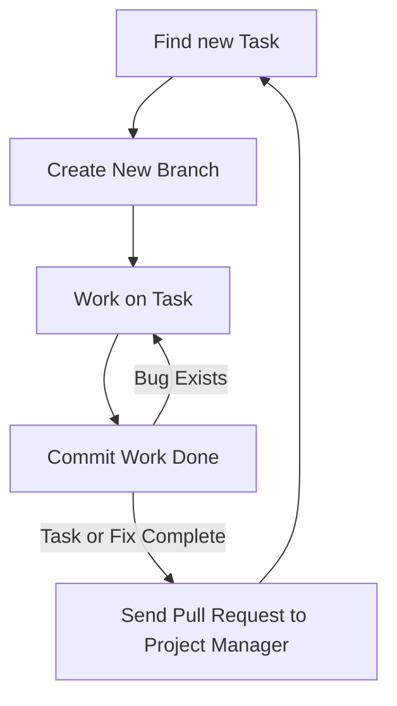

# ISOM 350
## Business Application Development

Mohammad AlMarzouq

Django Project Setup

---

## Types of Collaboration

- Synchronous
- Asynchronous

---

## Synchronous Collaboration

- Developer working together on the same file at the same time
- Enabled using replit.com multiplayer repls
- Great for knowledge sharing
  - A form of eXprogramming

--- 

## Synchronous Collaboration Limitation

- Requires time scheduling
- Limited number of participants (Usually 2)
- Member contribution not tracked

---

## Asynchronous Collaboration

- Developers working together over time
- Enabled using Git and GitHub
  - Integrated with replit.com
- Requires agreement on workflow
- Better fit for large group collaboration and effort tracking

---

## Asynchronous Collaboration Limitations

- Steep learning curve
- Overhead to using the tools
  - Greater benefits with larger groups
  - Still useful for individuals
- Benefit of using collaboration tools might not be clear
- Success dependent on choice from endless workflows

--- 

## Developer Workflow for Our Course

---

## Branches and Pull Requests

- Always create a branch from main/master to start your work
- Once done, create a pull request to ask the project manager to include your work (merge it) to the project
- Discussion can be started around a pull request where manager can ask members to fix problems in their work
- Pull request is completed if it is successfully merged

---



---



---



---

## Git and GitHub

- You need to distinguish between these two
- Git is the tool we use to keep track of the changes made to our source code and combine our work
- GitHub is the cloud platform hosting our git repositories
- GitHub also introduced social coding and project management features to be used with Git

---

## What About Replit?

- Replit is an cloud based IDE
- You use it to write code
- You can pull and push code between it and GitHub

---

## What About Replit?
- When you work alone you pull/import your work to replit.
- When you want your team to see your work you push it to GitHub from replit.
- You work is cloned (i.e., copied) to Replit and another on GitHub
- Each team member gets their own clone of the project code

---

## What If I Cannot Use GitHub?

- Part of your evaluation in this course is based on how well you collaborate through GitHub
- Using Git and GitHub is a very important skill for developers and managers in this age
- You can complete your final project using Synchronous collaboration on replit.com
  - Your grade will suffer from this