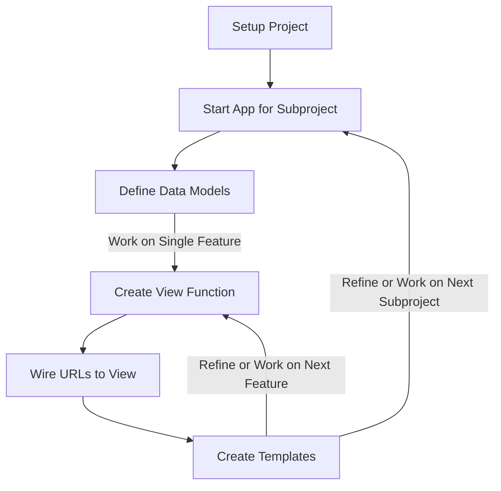

# ISOM 350
## Business Application Development

Mohammad AlMarzouq

Overview of Django Development Process

---

## Django's Development Model

- Django is a fullstack MVT web framework.
- Fullstack because it provides everything we need to build an app, from database handling to templates.
- It is MVT because its main components are:

1. **Models:** To handle data
2. **Views:** To handle business logic
3. **Templates:** To handle how screens will look

When building apps, we work on models, views, and templates to introduce new features.

---

## Benefits of MVT model

- Enables collaboration because work on each component is placed in a different file
- Team members can specialize
  - Data engineers focus on models
  - Backend engineers focus on views
  - Frontend engineers/designers focus on templates

---



---

## The Steps

--- 

### 1- Project Setup

- Creates directory structure for project files
- Specific files for specific functionality
- Done once at the beginning of the project

---

### Project Setup Methods

1. **(Recommended)** Creating a **Django Template** project in replit.com. 
2. Importing an existing Django project from GitHub.
3. Using **shell** you type a command to create a Django project.

---



---

Click Run to confirm proper setup



---

### 2- Start App or Subproject

- Code is organized in directories called apps
- Apps should hold related functionality, for example
  - acounts, cart, blog, store ..etc
- Project consists of single or multiple apps

---

### Creating an App

- Using shell, type the following command:

```bash
python manage.py startapp blog
```

---



---

### Adding The App to Our Project

- In `mysite/settings.py`  update the `INSTALLED_APPS` list to include our new blog app:

```python
INSTALLED_APPS = [
    'django.contrib.admin',
    'django.contrib.auth',
    'django.contrib.contenttypes',
    'django.contrib.sessions',
    'django.contrib.messages',
    'django.contrib.staticfiles',
    'blog',  # Make sure this line is added
]
```

---

### If you do not perform this step, Django will not see your app!
Do not forget it

---

### 3- Define Data Models

- Data models describe how the data in your project looks like
  - Determined in System Analysis and Design 
  - ER-Diagrams


---

### 3- Define Data Models

- Models used to abstractly manage database storage and retrieval
  - Database type and credentials configured in `mysite/settings.py`
- Each model will have a corresponding database table that is created automatically
  
--- 

### Example models.py File

```python
from django.db import models

class Author(models.Model):
    first_name = models.CharField(max_length=50)
    last_name = models.CharField(max_length=50)
    country = models.CharField(max_length=100)

class Book(models.Model):
    author = models.ForeignKey(
      Author, on_delete=models.CASCADE)
    title = models.CharField(max_length=100)
    release_date = models.DateField()
    num_stars = models.IntegerField()

```

---

### 4- Create View Function

- Main application server functionality
- Function for each web app functionality
- Handle HTTP request and generate HTTP response
  - First argument of the function is always the request
  - Must return an HTTP response

---

### Example views.py File

```python
from django.http import HttpResponse
import datetime

def current_datetime(request):
    now = datetime.datetime.now()
    html = "<html><body>It is now %s.</body></html>" % now
    return HttpResponse(html)
```

---

### 5- Wire URLs

- Assign a URL path to the view function
- This step will make the functionality available to the users
- Done by updating the file `mysite/urls.py`
  - Called the root urls.py file

---

### Example Root urls.py

```python
from django.urls import include, path
# Import the view function we created
from timeapp.views import current_datetime 

urlpatterns = [
    # Mapp the path time/ to the view function current_datetime
    path('time/', current_datetime, name='current-time'),
]
```

---

### 6- Create Template

- Templates are text files that are like fstrings
- The text file is usually an HTML file with some defined slots
- Allows designers to work independently from developers
- We insert dynamic data (called context) in these slots to generate a new dynamic web page
- Can also have basic logic like if and loops
  
---


### View Function Using Templates

```python
from django.shortcuts import render

from .models import Question


def index(request):
    latest_question_list = Question.objects.order_by('-pub_date')[:5]
    context = {'latest_question': latest_question_list}
    return render(request, 'polls/index.html', context)
```

---

### The polls/index.html File

```
<html>
    <body>
    
        <ul>
            <li><a href="/polls/{{ latest_question.id }}/">{{ latest_question.question_text }}</a></li>
        </ul>
    
        <p>No polls are available.</p>
    
    </body>
</html>
```

---


