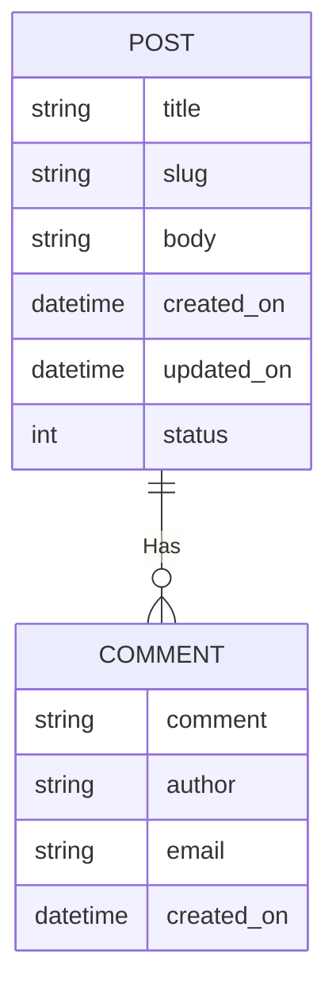

# ISOM 350
## Business Application Development

Mohammad AlMarzouq

Traversing Relationship

---

### Relationship in Django

- Represented in models using
  - ForeignKey
  - OneToOneField
  - ManyToMany Field

---

### Updating our Blog App

- Each blog post will have multiple comments
- Comment author will provide comment, optional name, and optional email
- Comments will be displayed along with author name in order below the post
- Date/Time of comment will be displayed next to it
- Number of comments and date/time of latest comment will be shown next to each post in post list

---

### Updated ERD


---

### Updated Models.py

```python
class Comment(models.Model):
  comment = models.TextField()
  author = models.CharField(max_length=100, blank=True, null=True)
  email = models.EmailField(blank=True, null=True)
  created_on = models.DateTimeField(auto_now_add=True)
  post = models.ForeignKey('Post', on_delete=models.CASCADE) 
```

---

### Admin and Migrations

- Create an inline Admin for the Post
- Don't forget makemigrations and migrate, why?
- Create at least 2 posts
- Create 2 comments for 1st post, and 3 comments for 2nd post.

---

### Traversing Relationship

- How do we display comments for each post?

---

## From Comment to Post

- The Many to One direction
- Just reference the relationship field:

```python
comment = Comment.objects.get(pk=id)
post = comment.post
```
- The post field will give you a Post object

---

### From Post to Comment

- The One to Many direction
- Use reverse relationships
- For every relationship Django makes available a field in the related model to allow moving in the other direction

--- 

### From Post to Comment

- For ForeignKey the reverse relationship gets the name model_set, for example comment_set in the current example
- It's just a model manager like objects, you can use all() and filter() on it
- Everything you learned about fetching objects using all and filter applies here as well
  
---

```python
post = Post.objects.get(pk=pid)
comments = post.comment_set.all()
```
- comments will include only the comments that belong to the post object in this example
- comments will be a list of objects
  
---

### The Reverse Relation Model Manager

- Everything you learned about the objects model manager applies
  - You can use all, filter, and get
  - also update, create, and delete (yet to be covered)
  - Applies to ForeignKeyField, ManyToManyField, and OneToOneField, but slightly different
  - Read the [documentation on model fields](https://docs.djangoproject.com/en/3.2/ref/models/fields/)

---

### Modifying The Reverse Relationship Name

- The attribute name by default is modelname_set
- Can be changed using the related_name option in Comment mode in models.py
```python
  post = models.ForeignKey('Post', 
    on_delete=models.CASCADE, 
    related_name="comments") 
```  
- Will replace `post.comment_set` with `post.comments`
- Useful for ManyToMany or multiple relationships of the same type
---

### Remember

- When traversing relationships, you are just fetching related data.
- Everything else about the view is just the same

---

### Updated Blog views.py

```python
def detailed_post_view(request, slug):
  data = {}
  post = Post.objects.get(slug=slug)
  data["post"] = post
  data["comments"] = post.comment_set.all()
  return render(request, "detailed_post.html", context=data)
```
- What if you wanted to filter comments to exclude ones without a name?

---

### detailed_post.html Template

```html
 <h1>{{ post.title}}</h1>
  <ul>
    <li>Posted on: {{ post.created_on }} </li>
    <li>Last updated: {{ post.updated_on }} </li>
  </ul>
  <p>
    {{ post.body }}
  </p>
  <h2>comments:</h2>
  <ul>
  
    <li>{{ c.author }}: {{ c.comment }}</li>
  
  </ul>
```

---

### The Result




Do not forget to wire the urls