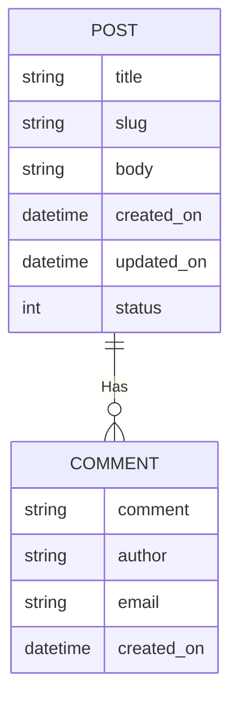

# ISOM 350
## Business Application Development

Mohammad AlMarzouq

Traversing Relationship

---

### Relationship in Django

- Represented in models using
  - ForeignKey
  - OneToOneField
  - ManyToMany Field

---

### Updating our Blog App

- Each blog post will have multiple comments
- Comment author will provide comment, optional name, and optional email
- Comments will be displayed along with author name in order below the post
- Date/Time of comment will be displayed next to it
- Number of comments and date/time of latest comment will be shown next to each post in post list

---

### Updated ERD


---

### Updated Models.py

```python
class Comment(models.model):
  comment = models.TextField()
  author = models.CharField(max_length=100, blank=True, null=True)
  email = models.EmailField(blank=True, null=True)
  post = models.ForeignKey('Post', on_delete=models.CASCADE) 
```

---

### Admin and Migrations

- Create an inline Admin for the Post
- Don't forget makemigrations and migrate, why?
- Create at least 2 posts
- Create 2 comments for 1st post, and 3 comments for 2nd post.

---

### Traversing Relationship

- How do we display comments for each post?

---

